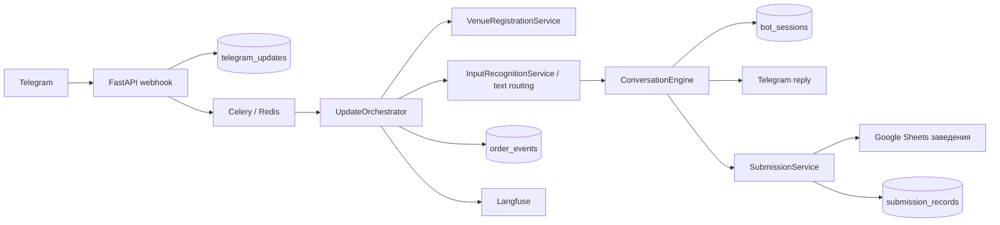

# Карта проекта

Документ помогает быстро найти код, но не заменяет чтение затронутых файлов. Актуальный перечень файлов, символов и тестов создаётся командой `python scripts/build_agent_context.py` в `.agents/runtime/CURRENT_CONTEXT.md`.

## Назначение

Проект — production Python-бот для закупок ресторанов. Он принимает текст, голос, фото и callback-кнопки в Telegram, ведёт черновик заявки, сопоставляет товары с каталогом конкретного заведения, записывает подтверждённые количества и комментарии в Google Sheets и показывает историю реальных заявок.

## Основной поток данных

## Точки входа

| Путь | Ответственность |
|---|---|
| `src/restaurant_bot/api/app.py` | Health endpoints, проверка webhook-secret, нормализация и идемпотентная постановка Telegram update в очередь |
| `src/restaurant_bot/workers/celery_app.py` | Конфигурация Celery и расписание фоновой очистки |
| `src/restaurant_bot/workers/tasks.py` | Обработка update, запись заявки, добавление товара, статусы и очистка аудита |
| `src/restaurant_bot/cli.py` | Служебные команды, включая webhook и синхронизацию привязок |

## Слои и модули

### Domain

`src/restaurant_bot/domain/models.py` содержит Pydantic-модели команд, позиций, состояния диалога, кнопок, ответов и событий. Изменение поля состояния требует проверки сериализации, репозитория сессий и сценариев восстановления.

### Services

| Модуль | Роль |
|---|---|
| `services/orchestrator.py` | Транзакционный pipeline: claim update, регистрация и доступ, блокировка чата, загрузка состояния, текстовая маршрутизация, каталог, engine, сохранение, задачи и доставка ответа |
| `services/engine.py` | Детерминированная state machine, приоритет незавершённых вопросов, команды, callback и переходы черновика |
| `conversation/comments.py` | Channel-neutral операции подтверждённых комментариев, comment scope, provenance-нормализация и comment shadows |
| `conversation/draft.py` | Channel-neutral операции целостности черновика и слияния подтверждённых дублей |
| `conversation/progression.py` | Channel-neutral переход к следующей нерешённой позиции и смена progression stage без presentation |
| `services/input_recognition.py` | Скачивание voice/photo, транскрибация с безопасным fallback и обновление карточки прогресса |
| `services/parser.py` | Text intent facade, callback contract и временный dispatcher command parsing |
| `parsing/commands/patterns.py` | Статические шаблоны text-команд |
| `parsing/commands/normalization.py` | Нормализация команд и отрицание |
| `parsing/commands/navigation.py` | Свободная навигация и order-status text commands |
| `parsing/commands/item_commands.py` | Add/remove/edit item command parsing |
| `parsing/commands/comment_commands.py` | Изменение комментариев существующих позиций |
| `parsing/commands/dialogue.py` | Retry, quantity hint и dialogue response metadata |
| `parsing/commands/router.py` | Порядок text command routing без callback contract |
| `parsing/products.py` | Разбор товарных строк и сборка `ExtractedItem` без внешних эффектов |
| `parsing/quantities.py` | Короткие quantity primitives |
| `parsing/packaging.py` | Фасовка и каталожные measurement spans |
| `parsing/comment_scope.py` | Явная область общего комментария во входной товарной строке |
| `parsing/ai/schemas.py` | Declarative Pydantic-схемы structured output без алгоритмов |
| `parsing/ai/quantity_reconciliation.py` | Проверка количества заказа, фасовки и диапазонов по source evidence |
| `parsing/ai/comment_reconciliation.py` | Provenance, scope и comment bindings structured AI output |
| `parsing/ai/item_reconciliation.py` | Source qualifier cleanup, omitted item и mixed-script recovery |
| `parsing/ai/shadow_items.py` | Shadow projections, connector fragments и source variants |
| `parsing/ai/reconciliation.py` | Сохраняемый порядок общей AI reconciliation pipeline |
| `services/comment_policy.py` | Единая policy явных пожеланий поставщику для детерминированного и AI-разбора |
| `catalog/resolver.py` | Область поиска поставщика, кандидаты и hard veto безопасного автосопоставления |
| `conversation/selection.py` | Channel-neutral score, targeting позиции черновика и выбор кандидата без callback/transport contracts |
| `conversation/routing/` | Channel-neutral contracts и StateCompatibilityPolicy, сгруппированные по item resolution, order/review и comment scope; modal routing остаётся агрегатором |
| `conversation/state/queries.py` | Канонические unresolved membership/priority, `first_unresolved` и `item_index` без мутации состояния |
| `services/conversation_handlers/` | Legacy Telegram/presentation handlers: количество, выбор товара, область комментария, финальная проверка, статусы и пассивная навигация |
| `services/conversation_handlers/state_compatibility.py` | Compatibility re-export facade для `conversation/routing/state_compatibility.py` |
| `services/conversation_handlers/modal_routing.py` | Compatibility re-export facade для `conversation/routing/modal_routing.py` |
| `services/conversation_handlers/state.py` | Compatibility re-export facade для `conversation/state/queries.py` |

После Block 5B `conversation/comments.py` и `conversation/draft.py` являются
единственными владельцами перечисленных core-операций. `comment_scope.py`
сохраняет handler и делегирует им выполнение; Telegram/presentation handlers
не переносятся механически. Исторически разные функции объединения комментариев
сохранены раздельно, потому что engine нормализует внутренние пробелы, а
CommentScopeHandler их сохраняет.
| `services/input_normalizer.py` | Приведение Telegram payload к единому `TelegramEvent` |
| `catalog/evidence.py` | Каноническое представление, токены, query/catalog evidence и supplier hint matching |
| `catalog/scoring.py` | Детерминированная оценка одного каталожного товара |
| `catalog/retrieval.py` | Ограниченный in-memory поиск, admission и порядок кандидатов |
| `catalog/safety.py` | Конфликты квалификаторов, numeric compatibility, safe equivalence, broad-category policy и auto-select safety |
| `services/matching.py` | Compatibility path для catalog re-export; transitional quantity helper `nearest_valid_multiple` остаётся единственной legacy non-catalog реализацией |
| `services/catalog_resolver.py` | Чистый compatibility re-export facade для `catalog/resolver.py` |
| `services/replies.py` | Пользовательские карточки и клавиатуры основного диалога |
| `services/submission.py` | Контрольные точки записи, пересчёта, опциональной отправки и чтения статусов |
| `services/submission_presenter.py` | Тексты и кнопки завершения заявки и истории заказов |
| `services/product_add_flow.py` | Сценарий запроса снабженцу на добавление ненайденного товара |
| `services/venue_registration.py` | Центральный каталог заведений, доступ, invite-коды и привязки |
| `services/text.py` | Нормализация текста, единиц, чисел и комментариев |

### Integrations

| Модуль | Внешняя система |
|---|---|
| `integrations/telegram.py` | Telegram Bot API, скачивание файлов, ответы, edit/delete и callback acknowledgement |
| `integrations/openai_client.py` | Транскрибация, разбор текста и фото, AI-сопоставление и наблюдаемость |
| `integrations/openai_parsing.py` | Временный re-export facade для доказанных старых import paths; алгоритмов нет |
| `integrations/openai_prompts.py` | Системные промпты текста, фото, сопоставления и выбора действий |
| `integrations/google_sheets.py` | Каталог, лист заказа, пересчёт, лист добавления товара, история и опциональная центральная отправка |
| `integrations/cache.py` | Redis-кэш каталога, chat lock и lock по таблице заведения |

### Persistence

| Модуль / таблица | Назначение |
|---|---|
| `repositories/updates.py` / `telegram_updates` | Inbox и идемпотентность Telegram update |
| `repositories/sessions.py` / `bot_sessions` | Версионированное состояние диалога и черновик |
| `repositories/submissions.py` / `submission_records` | Идемпотентные контрольные точки записи и отправки |
| `repositories/order_events.py` / `order_events` | Ограниченный аудит жизненного цикла заказа |
| `repositories/venue_bindings.py` / `venue_bindings` | Активные привязки пользователей и чатов к заведению |
| `alembic/versions/` | Единственный разрешённый способ эволюции схемы PostgreSQL |

## Критические пользовательские маршруты

### Текст, голос и фото

1. Webhook сохраняет update один раз.
2. Worker получает update и берёт lock чата.
3. Регистрация проверяет актуальный доступ и таблицу заведения.
4. `InputRecognitionService` транскрибирует voice и распознаёт photo; text маршрутизируется напрямую.
5. Детерминированные правила защищают навигационные и отрицательные фразы от превращения в товары; неоднозначные признаки остаются в поисковом названии, а не становятся пожеланием поставщику.
6. AI помогает понять свободную речь, но окончательное изменение делает state machine.
7. Каталог и безопасное сопоставление определяют точный товар, варианты или ненайденную позицию.
8. Состояние и ответ сохраняются до доставки, чтобы повтор не повторил бизнес-действие.

### Подтверждение заявки

1. Engine не разрешает завершение при нерешённых количествах, дублях или выборе товара.
2. Создаётся `PendingSubmission` и Celery-задача.
3. `SubmissionService` повторно проверяет доступ.
4. По таблице заведения берётся отдельный Redis-lock.
5. Количества и подтверждённые пользовательские комментарии записываются в лист заказа; справочное примечание каталога хранится отдельно.
6. Запускается пересчёт таблицы.
7. При `GOOGLE_ORDER_SUBMISSION_ENABLED=false` центральный Apps Script не вызывается.
8. Контрольные точки сохраняются, черновик завершается, пользователю приходит честное подтверждение записи.

### Статусы

1. Доступ и текущая таблица заведения проверяются заново.
2. `GoogleSheetsGateway` читает лист истории только этой таблицы.
3. Строки группируются по номеру одной заявки и поставщикам.
4. Пользователь получает страницы по пять заявок и может открыть нужную кнопкой или голосом.

### Новый товар

Ненайденная позиция не заменяется похожей автоматически. После подтверждения отдельная задача записывает запрос в лист добавления товара для дальнейшей обработки снабженцем.

## Внешние зависимости и данные

- PostgreSQL: долговременное состояние, inbox, checkpoints, аудит и привязки.
- Redis: Celery broker/result backend, кэш и распределённые блокировки.
- Telegram: входящие updates и пользовательский интерфейс.
- OpenAI: транскрибация и понимание свободной речи/изображений.
- Google Sheets: каталог и рабочие данные каждого заведения.
- Langfuse: трассировка AI-вызовов и стоимость при корректной конфигурации.

Значения секретов никогда не документируются. Имена и текущая форма настроек находятся в `src/restaurant_bot/config.py` и `.env.example`.

## Карта тестов

| Каталог | Что защищает |
|---|---|
| `tests/api/` | Webhook, secret и health endpoints |
| `tests/input/` | Нормализация, голосовая маршрутизация и AI-контракты входа |
| `tests/conversation/` | State machine, команды, комментарии, UI и сквозной orchestrator |
| `tests/catalog/` | Поиск, кандидаты и запрет опасной автоподстановки |
| `tests/quantity/` | Количество, единицы, кратность, дубли и исправления |
| `tests/submission/` | Guards, checkpoints, запись, минимум поставщика и статусы |
| `tests/venue/` | Регистрация, отзыв доступа и изоляция заведений |
| `tests/telegram/` | Команды, callback revision и управление статусами голосом |
| `tests/product_add/` | Запрос на добавление ненайденного товара |
| `tests/repositories/` | БД-модели, индексы и идемпотентность репозиториев |
| `tests/workers/` | Celery retry и делегирование задач |
| `tests/docs/`, `tests/ci/` | Сценарии, docstring, ссылки и документационные контракты |

Канонический каталог пользовательских сценариев: `docs/user-scenarios/scenarios.json`. Markdown и HTML генерируются из него, поэтому вручную редактировать производные файлы нельзя.
