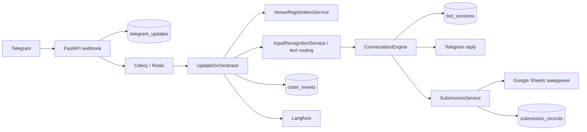

# Карта проекта

## Актуальный статус после Block 6D

`services/text.py` удалён после доказанного механического переноса `to_float` в
`parsing/numeric.py`; свежий baseline — `1378 collected / 1378 passed`, финальный
suite после acceptance coverage — `1380 collected / 1380 passed`. Stateful и
effectful services намеренно сохранены. Подробный текущий аудит находится в
`docs/SERVICES_TRANSITION_AUDIT.md`; исторические разделы ниже не переопределяют
этот статус. Block 6D завершён; следующий шаг — `CONTROLLED HUMAN PILOT`.

## IMPLEMENTED AFTER 5Z / BLOCK 6A

Telegram-specific semantic input boundary теперь находится в
`input/telegram_interpretation.py` (`TelegramInputInterpreter`). Он получает
`TelegramEvent`, `ConversationState` и injected provider/recognizer/policy и
возвращает `ParsedCommand`. В модуле нет DB, Redis, Telegram transport,
Sheets, catalog cache, engine, review, registration, checkpoint или task
зависимостей. `UpdateOrchestrator` только создаёт owner и вызывает
`interpret(...)`; `_recognizer()` сохранён lazy seam. Полный baseline после
переноса: `1377/1377` (исторический); текущий Block 6D baseline — `1378/1378`,
финальный — `1380/1380`. Пост-6A reassessment в
[`docs/UPDATE_ORCHESTRATOR_AUDIT.md`](../docs/UPDATE_ORCHESTRATOR_AUDIT.md)
выбрал `ORCHESTRATOR_DECOMPOSITION_SUFFICIENT`; следующая кампания —
`BLOCK 6D — FINAL STABILIZATION / ACCEPTANCE CLOSURE`.

Block 6C переключил текущий фокус с decomposition на testing readiness. Block 6D
закрыл два acceptance gaps; текущий отчёт находится в
[`docs/TESTING_READINESS.md`](../docs/TESTING_READINESS.md): full suite `1380/1380`,
verdict `READY_FOR_MANUAL_TESTING_WITH_KNOWN_NONBLOCKERS`.

## Current architecture after Block 5Y

Detailed current `UpdateOrchestrator` forensic inventory is maintained in
[`docs/UPDATE_ORCHESTRATOR_AUDIT.md`](../docs/UPDATE_ORCHESTRATOR_AUDIT.md).

Block 5Y завершил controlled cleanup draft/comment/progression seams без изменения
поведения; свежий полный suite: `1377 collected / 1377 passed`. Публичные методы
`ContextualCommandPolicy` сохраняют порядок pre-modal voice и contextual
fallback. `input/telegram_visible_actions.py` — Telegram-only owner извлечения
страниц из `visible_actions`; routing policy не импортирует transport,
presentation, integrations или services и не знает `v2:*`.

`orders/catalog_resolution.py` — единственный owner `match_item`,
`apply_catalog`, `refresh_cart_order_values`; engine/orchestrator вызывают его
напрямую. Draft mutations принадлежат `conversation/draft_actions.py`, comment
operations — `conversation/comments.py`, progression state —
`conversation/progression.py`, Telegram rendering —
`presentation/telegram/progression.py`, transient reset —
`conversation/state/transitions.py`. Engine содержит `1535` строк, `72673` байта
и `30` методов; state-mutating methods: `18 → 13`, `MISMATCHES = 0`.
Порядок stateful orchestration и stale callback guard сохранены. Тонкие adapters
`_build_item`, `_spoken_quantity`, `_cart_page`, `_callback_item_index` оставлены;
`_spoken_quantity` имеет production caller в orchestrator. Quantity, new-order,
product-add и submission остаются protected, candidate selection — `KEEP_TEMP`.
Readiness: `ENGINE_PHASE_ACCEPTABLE`; следующая единственная кампания —
`BLOCK 6C — STABILIZATION / REALISTIC SMOKE / ACCEPTANCE PREP`; Block 6B не
выбрал новый production implementation seam.

## Current architecture after Block 5X (архив)

Block 5X завершил contextual/catalog boundary cleanup без изменения поведения;
его опубликованный baseline: `1370 collected / 1370 passed`. Публичные методы
`ContextualCommandPolicy` сохраняют прежние contracts, а catalog owners ниже
являются историческим срезом перед Block 5Y.

## Current architecture after Block 5W (архив)

На актуальном срезе `decompose_bot` базовый полный suite даёт `1369 passed`.
Нейтральный контракт заведений находится в `venues/`; fallback-модели OpenAI принадлежат
`integrations/openai_transcription_policy.py`. Контекстная routing policy находится в
`conversation/routing/contextual_commands.py`, построение `CartItem` — в
`conversation/item_intake.py`. `services/engine.py` остаётся координатором TelegramEvent
и EngineResult: после Block 5W это 1680 строк и 42 метода вместо 2563 строк и 63 методов.
Ниже перечислены текущие владельцы; исторические таблицы после этого раздела не являются
источником текущей архитектуры.

Актуальные владельцы имеют приоритет при чтении этой карты:

| Область | Владелец | Граница |
|---|---|---|
| Текстовая команда | `parsing/commands/api.py` | Чистый semantic parser |
| Callback Telegram | `input/telegram_callbacks.py` | Декодирование `v2:*` и revision |
| Telegram replies | `presentation/telegram/replies.py` | Только чтение state и построение `BotReply` |
| Review contracts | `application/order_review/contracts.py` | Frozen `ReviewItem` и `ReviewSnapshot` |
| Review snapshot | `application/order_review/snapshot.py` | Чистая агрегация и fingerprint |
| Review token | `application/order_review/token.py` | Формат `uuid4().hex[:20]` |
| Review presentation | `presentation/telegram/order_review.py` | Preview, truncation и submission replies |
| Review effects | `services/order_review.py` | Lease/DB/Sheets/Telegram coordination |
| Cart page transition | `conversation/state/transitions.py` | Clamp persisted page before rendering |
| Telegram page-size constants | `presentation/telegram/pagination.py` | Telegram presentation owns page size |
| Voice policy | `input/voice_policy.py` | Pure visible-action/prompt/model policy |
| OpenAI transcription fallback | `integrations/openai_transcription_policy.py` | Provider-specific model capability |
| Contextual conversation commands | `conversation/routing/contextual_commands.py` | Channel-neutral contextual fallback |
| Cart item intake | `conversation/item_intake.py` | Pure `ExtractedItem` → `CartItem` construction |
| Neutral venue contract | `venues/contracts.py`, `venues/codes.py` | Frozen value object and pure code rules |
| Venue directory | `integrations/venue_directory.py` | GViz fetch, parse, cache and code primitives |
| Venue access registry | `integrations/venue_access_registry.py` | Access rows, decision and cache |
| Venue registration input | `input/telegram_venue_registration.py` | Telegram commands and callbacks |
| Venue registration presentation | `presentation/telegram/venue_registration.py` | Registration replies/buttons only |

Историческое описание после Block 5U: `services/parser.py`, `services/replies.py` и
`services/product_add_flow.py` отсутствуют. Таблицы ниже описывают текущие
модули; исторические аудиты помечены явно и не являются owner-map.

Block 5V оставил `services/input_recognition.py` переходным координатором
media/provider/state-aware flow; pure voice policy находится в
`input/voice_policy.py`. `services/venue_registration.py` координирует только
DB/Sheets/cache/rollback и re-export-ит переходные `VenueContext` и
`RegistrationResult`; каталог, access registry, Telegram input и replies имеют
отдельных владельцев выше.

## Block 5S — актуальные владельцы бывших `services.text` символов

После Block 5S `services/text.py` содержит только transitional `to_float`.
Канонические owners: `domain/units.py` (`UNIT_ALIASES`, `normalize_unit`),
`domain/unit_conversion.py` (`convert_quantity`), `domain/departments.py`
(`DEPARTMENT_ALIASES`, `normalize_department`), `parsing/number_words.py`
(`NUMBER_WORDS`, `parse_number_words`), `parsing/numeric_ranges.py`
(`numeric_range_spans`), `conversation/comments.py`
(`remove_global_comment_overlap`) и `catalog/evidence.py`
(`remove_phrase_overlap`). Перенесённые production и test imports проверены;
старых путей для этих символов нет. `to_float` оставлен в `services/text.py`,
потому что его контракт одновременно покрывает Google Sheets и AI-reconciliation.

## Block 5R: Telegram presentation formatting

`presentation/telegram/formatting.py` — канонический owner `escape` и
`format_number`. Он зависит только от `text_normalization`; `services/text.py`
сохраняет measurement, overlap и parsing primitives. `presentation/telegram/submission.py`
использует новый owner и больше не импортирует `services`.

## Block 5P: владельцы политики транскрипции

`src/restaurant_bot/input/voice_transcript_policy.py` содержит две чистые функции
выбора и проверки транскрипции. `src/restaurant_bot/services/input_recognition.py`
остаётся transitional coordinator для Telegram/OpenAI voice/photo и state-aware
retry, но больше не владеет этими двумя алгоритмами.

Документ помогает быстро найти код, но не заменяет чтение затронутых файлов. Актуальный перечень файлов, символов и тестов создаётся командой `python scripts/build_agent_context.py` в `.agents/runtime/CURRENT_CONTEXT.md`.

## Назначение

Проект — production Python-бот для закупок ресторанов. Он принимает текст, голос, фото и callback-кнопки в Telegram, ведёт черновик заявки, сопоставляет товары с каталогом конкретного заведения, записывает подтверждённые количества и комментарии в Google Sheets и показывает историю реальных заявок.

## Основной поток данных

## Точки входа

| Путь | Ответственность |
|---|---|
| `src/restaurant_bot/api/app.py` | Health endpoints, проверка webhook-secret, нормализация и идемпотентная постановка Telegram update в очередь |
| `src/restaurant_bot/workers/celery_app.py` | Конфигурация Celery и расписание фоновой очистки |
| `src/restaurant_bot/workers/tasks.py` | Celery delivery, task implementations и внешний adapter фоновых задач |
| `src/restaurant_bot/cli.py` | Служебные команды, включая webhook и синхронизацию привязок |

## Слои и модули

### Domain

`src/restaurant_bot/domain/models.py` содержит Pydantic-модели команд, позиций, состояния диалога, кнопок, ответов и событий. Изменение поля состояния требует проверки сериализации, репозитория сессий и сценариев восстановления.

### Services

| Модуль | Роль |
|---|---|
| `services/orchestrator.py` | Транзакционный pipeline: claim update, регистрация и доступ, блокировка чата, загрузка состояния, текстовая маршрутизация, каталог, engine, application task port и доставка ответа |
| `services/engine.py` | Transitional orchestration state machine: приоритет незавершённых вопросов, команды, callback и переходы черновика; применение каталога делегирует `orders/catalog_resolution.py` |
| `conversation/comments.py` | Channel-neutral операции подтверждённых комментариев, comment scope, provenance-нормализация и comment shadows |
| `conversation/draft.py` | Channel-neutral операции целостности черновика и слияния подтверждённых дублей |
| `conversation/progression.py` | Channel-neutral переход к следующей нерешённой позиции и смена progression stage без presentation |
| `conversation/quantity_resolution.py` | Channel-neutral расчёт кратности, рекомендуемого количества и выбор предупреждений без изменения черновика |
| `orders/supplier_minimums.py` | Channel-neutral агрегация минимальных сумм поставщиков и предупреждений без изменения состояния |
| `orders/catalog_resolution.py` | Channel-neutral применение результата `CatalogResolver` к `CartItem`: каталожные поля, quantity/comment provenance, статусы и refresh черновика |
| `services/input_recognition.py` | Transitional voice/photo recognition: Telegram transport, OpenAI calls, state-aware retry, visible actions и progress; Block 5O назначил единственный следующий transcript-policy seam, полный MOVE не принят |
| `parsing/commands/api.py` | Text intent API и enrichment ParsedCommand; прежний `services/parser.py` удалён в Block 5U |
| `parsing/commands/patterns.py` | Статические шаблоны text-команд |
| `parsing/commands/normalization.py` | Нормализация команд и отрицание |
| `parsing/commands/navigation.py` | Свободная навигация и order-status text commands |
| `parsing/commands/item_commands.py` | Add/remove/edit item command parsing |
| `parsing/commands/comment_commands.py` | Изменение комментариев существующих позиций |
| `parsing/commands/dialogue.py` | Retry, quantity hint и dialogue response metadata |
| `parsing/commands/router.py` | Порядок text command routing без callback contract |
| `parsing/products.py` | Разбор товарных строк и сборка `ExtractedItem` без внешних эффектов |
| `parsing/quantities.py` | Короткие quantity primitives |
| `parsing/packaging.py` | Фасовка и каталожные measurement spans |
| `parsing/comment_scope.py` | Явная область общего комментария во входной товарной строке |
| `parsing/comment_policy.py` | Единая policy явных пожеланий поставщику для детерминированного и AI-разбора |
| `parsing/ai/schemas.py` | Declarative Pydantic-схемы structured output без алгоритмов |
| `parsing/ai/quantity_reconciliation.py` | Проверка количества заказа, фасовки и диапазонов по source evidence |
| `parsing/ai/comment_reconciliation.py` | Provenance, scope и comment bindings structured AI output |
| `parsing/ai/item_reconciliation.py` | Source qualifier cleanup, omitted item и mixed-script recovery |
| `parsing/ai/shadow_items.py` | Shadow projections, connector fragments и source variants |
| `parsing/ai/reconciliation.py` | Сохраняемый порядок общей AI reconciliation pipeline |
| `catalog/resolver.py` | Область поиска поставщика, кандидаты и hard veto безопасного автосопоставления |
| `conversation/selection.py` | Channel-neutral score, targeting позиции черновика и выбор кандидата без callback/transport contracts |
| `conversation/routing/` | Channel-neutral contracts и StateCompatibilityPolicy, сгруппированные по item resolution, order/review и comment scope; modal routing остаётся агрегатором |
| `conversation/state/queries.py` | Канонические unresolved membership/priority, `first_unresolved` и `item_index` без мутации состояния |
| `services/conversation_handlers/` | Legacy Telegram/presentation handlers: количество, выбор товара, область комментария, финальная проверка, статусы и пассивная навигация |

Полный audit transitional `services/`, callers и выполненные migration seams
зафиксированы в `docs/SERVICES_TRANSITION_AUDIT.md`. После Block 5J obsolete
compatibility facades удалены после подтверждённого нулевого caller-аудита;
реальные owners находятся в `catalog/` и `conversation/`.

После Block 5B `conversation/comments.py` и `conversation/draft.py` являются
единственными владельцами перечисленных core-операций. `comment_scope.py`
сохраняет handler и делегирует им выполнение; Telegram/presentation handlers
не переносятся механически. Исторически разные функции объединения комментариев
сохранены раздельно, потому что engine нормализует внутренние пробелы, а
CommentScopeHandler их сохраняет.
| `input/telegram.py` | Каноническое приведение Telegram raw payload к `TelegramEvent`; input/recognition остаётся отдельным transitional adapter |
| `catalog/evidence.py` | Каноническое представление, токены, query/catalog evidence и supplier hint matching |
| `catalog/scoring.py` | Детерминированная оценка одного каталожного товара |
| `catalog/retrieval.py` | Ограниченный in-memory поиск, admission и порядок кандидатов |
| `catalog/safety.py` | Конфликты квалификаторов, numeric compatibility, safe equivalence, broad-category policy и auto-select safety |
| `presentation/telegram/replies.py` | Пользовательские карточки и клавиатуры основного диалога; presenter не меняет ConversationState |
| `services/submission.py` | Контрольные точки записи, пересчёта, опциональной отправки и чтения статусов |
| `presentation/telegram/submission.py` | Telegram-тексты, кнопки завершения заявки и истории заказов; канонический owner после Block 5Q |
| `orders/product_add.py`, `conversation/product_add.py`, `presentation/telegram/product_add.py` | Сценарий запроса снабженцу на добавление ненайденного товара |
| `services/venue_registration.py` | Координатор DB/Sheets/cache/rollback привязки; directory, access, input и replies вынесены в Block 5V |
| `services/text.py` | Transitional владелец только `to_float`; units, departments, number words, ranges и overlap перенесены в канонические domain/parsing/catalog/conversation owners; полный аудит — [`docs/SERVICES_TEXT_AUDIT.md`](../docs/SERVICES_TEXT_AUDIT.md) |

### Application contracts

| Модуль | Роль |
|---|---|
| `application/background_tasks.py` | Типизированный порт фоновых эффектов без зависимости от Celery или workers |
| `application/order_review/contracts.py` | Frozen `ReviewItem` и `ReviewSnapshot` |
| `application/order_review/snapshot.py` | Чистая агрегация review snapshot и SHA256 fingerprint |
| `application/order_review/token.py` | Формат review token без внешних зависимостей |

### Integrations

| Модуль | Внешняя система |
|---|---|
| `integrations/telegram.py` | Telegram Bot API, скачивание файлов, ответы, edit/delete и callback acknowledgement |
| `integrations/openai_client.py` | Транскрибация, разбор текста и фото, AI-сопоставление и наблюдаемость |
| `integrations/openai_parsing.py` | Временный re-export facade для доказанных старых import paths; алгоритмов нет |
| `integrations/openai_prompts.py` | Системные промпты текста, фото, сопоставления и выбора действий |
| `integrations/google_sheets.py` | Каталог, лист заказа, пересчёт, лист добавления товара, история и опциональная центральная отправка |
| `integrations/cache.py` | Redis-кэш каталога, chat lock и lock по таблице заведения |

### Persistence

| Модуль / таблица | Назначение |
|---|---|
| `repositories/updates.py` / `telegram_updates` | Inbox и идемпотентность Telegram update |
| `repositories/sessions.py` / `bot_sessions` | Версионированное состояние диалога и черновик |
| `repositories/submissions.py` / `submission_records` | Идемпотентные контрольные точки записи и отправки |
| `repositories/order_events.py` / `order_events` | Ограниченный аудит жизненного цикла заказа |
| `repositories/venue_bindings.py` / `venue_bindings` | Активные привязки пользователей и чатов к заведению |
| `alembic/versions/` | Единственный разрешённый способ эволюции схемы PostgreSQL |

## Критические пользовательские маршруты

### Текст, голос и фото

1. Webhook сохраняет update один раз.
2. Worker получает update и берёт lock чата.
3. Регистрация проверяет актуальный доступ и таблицу заведения.
4. `InputRecognitionService` транскрибирует voice и распознаёт photo; text маршрутизируется напрямую.
5. Детерминированные правила защищают навигационные и отрицательные фразы от превращения в товары; неоднозначные признаки остаются в поисковом названии, а не становятся пожеланием поставщику.
6. AI помогает понять свободную речь, но окончательное изменение делает state machine.
7. Каталог и безопасное сопоставление определяют точный товар, варианты или ненайденную позицию.
8. Состояние и ответ сохраняются до доставки, чтобы повтор не повторил бизнес-действие.

### Подтверждение заявки

1. Engine не разрешает завершение при нерешённых количествах, дублях или выборе товара.
2. Создаётся `PendingSubmission` и Celery-задача.
3. `SubmissionService` повторно проверяет доступ.
4. По таблице заведения берётся отдельный Redis-lock.
5. Количества и подтверждённые пользовательские комментарии записываются в лист заказа; справочное примечание каталога хранится отдельно.
6. Запускается пересчёт таблицы.
7. При `GOOGLE_ORDER_SUBMISSION_ENABLED=false` центральный Apps Script не вызывается.
8. Контрольные точки сохраняются, черновик завершается, пользователю приходит честное подтверждение записи.

### Статусы

1. Доступ и текущая таблица заведения проверяются заново.
2. `GoogleSheetsGateway` читает лист истории только этой таблицы.
3. Строки группируются по номеру одной заявки и поставщикам.
4. Пользователь получает страницы по пять заявок и может открыть нужную кнопкой или голосом.

### Новый товар

Ненайденная позиция не заменяется похожей автоматически. После подтверждения отдельная задача записывает запрос в лист добавления товара для дальнейшей обработки снабженцем.

## Внешние зависимости и данные

- PostgreSQL: долговременное состояние, inbox, checkpoints, аудит и привязки.
- Redis: Celery broker/result backend, кэш и распределённые блокировки.
- Telegram: входящие updates и пользовательский интерфейс.
- OpenAI: транскрибация и понимание свободной речи/изображений.
- Google Sheets: каталог и рабочие данные каждого заведения.
- Langfuse: трассировка AI-вызовов и стоимость при корректной конфигурации.

Значения секретов никогда не документируются. Имена и текущая форма настроек находятся в `src/restaurant_bot/config.py` и `.env.example`.

## Карта тестов

| Каталог | Что защищает |
|---|---|
| `tests/api/` | Webhook, secret и health endpoints |
| `tests/input/` | Нормализация, голосовая маршрутизация и AI-контракты входа |
| `tests/conversation/` | State machine, команды, комментарии, UI и сквозной orchestrator |
| `tests/catalog/` | Поиск, кандидаты и запрет опасной автоподстановки |
| `tests/quantity/` | Количество, единицы, кратность, дубли и исправления |
| `tests/submission/` | Guards, checkpoints, запись, минимум поставщика и статусы |
| `tests/venue/` | Регистрация, отзыв доступа и изоляция заведений |
| `tests/telegram/` | Команды, callback revision и управление статусами голосом |
| `tests/product_add/` | Запрос на добавление ненайденного товара |
| `tests/repositories/` | БД-модели, индексы и идемпотентность репозиториев |
| `tests/workers/` | Celery retry и делегирование задач |
| `tests/docs/`, `tests/ci/` | Сценарии, docstring, ссылки и документационные контракты |

Канонический каталог пользовательских сценариев: `docs/user-scenarios/scenarios.json`. Markdown и HTML генерируются из него, поэтому вручную редактировать производные файлы нельзя.
## Block 6C — current services cleanup

`services/text.py` удалён после переноса единственного символа `to_float` в
`parsing/numeric.py`. Четыре lower/core AI-reconciliation модуля и два integration
адаптера используют новый owner; функциональный baseline после переноса остаётся
`1377/1377`, финальный suite с новым regression test — `1378 passed`.
`engine.py`, `orchestrator.py`, `submission.py`, `venue_registration.py`,
`input_recognition.py`, `order_review.py` и conversation handlers намеренно остаются
в `services/`: они координируют state, внешние эффекты, Telegram presentation или
надежностные contracts, и безопасного существующего owner для механического переноса
нет. Следующая функциональная задача — `BLOCK 6D — STABILIZATION / REALISTIC SMOKE /
ACCEPTANCE PREP`; новую декомпозицию не начинать.

## Block 5T — historical migration notes

Канонический semantic text parser находится в `parsing/commands/api.py`, а
Telegram callback contract — в `input/telegram_callbacks.py`. В Block 5U
устаревший `services/parser.py` удалён после миграции тестовых callers.

Product-add owners: `orders/product_add.py`, `conversation/product_add.py` и
`presentation/telegram/product_add.py`. Telegram replies принадлежат
`presentation/telegram/replies.py`; чистая подсказка фасовки принадлежит
`orders/package_suggestions.py`. `services/product_add_flow.py` и
`services/replies.py` удалены. `services/text.py` по-прежнему содержит только
`to_float`, потому что Sheets и AI-reconciliation контракты пока не имеют
доказанного единого нового owner.

Эта секция сохранена как историческая заметка; текущая карта владельцев указана
в начале файла.
