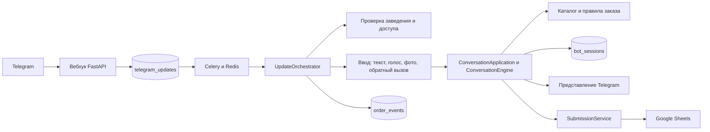

# Карта проекта

Проект — боевой Python-бот для закупок ресторанов. Он принимает текст, голос,
фото и обратный вызов Telegram, ведёт черновик, безопасно сопоставляет товары с
каталогом заведения, записывает подтверждённые данные в Google Sheets и показывает
историю заявок.

Карта помогает найти владельца кода, но не заменяет чтение конкретного сценария и
его тестов. Точные текущие пути и символы дополняет автоснимок
`.agents/runtime/CURRENT_CONTEXT.md`.

## 1. Архитектурная схема

Фактический путь update из Telegram:

`вебхук → надёжный входящий журнал → задача Celery → захват и аренда чата → доступ к заведению → распознавание ввода → разбор/сверка ИИ → машина состояний → каталог/заказ/диалог → транзакция состояния и контрольных точек → ответ Telegram и разрешённые фоновые эффекты`.

## 2. Точки входа и внешние системы

| Путь | Ответственность |
|---|---|
| `api/app.py` | Проверки работоспособности, секрет вебхука, приём и идемпотентная постановка update |
| `workers/celery_app.py` | Настройка Celery и расписание очистки |
| `workers/tasks.py` | Точки запуска фоновых задач и их адаптеры |
| `cli.py` | Служебные команды, включая вебхук и синхронизацию привязок |
| `integrations/telegram.py` | Telegram Bot API, файлы, отправка/изменение/удаление сообщений и подтверждение обратного вызова |
| `integrations/openai_client.py` | Транскрипция, разбор текста и фото, сопоставление ИИ и наблюдаемость |
| `integrations/google_sheets.py` | Каталог, заказ, пересчёт, история и лист запроса снабженцу |
| `integrations/cache.py` | Кэш Redis и распределённые блокировки |

Внешние зависимости: PostgreSQL хранит надёжное состояние, входящий журнал,
контрольные точки, аудит и привязки; Redis — брокер, хранилище результатов, кэш и
аренды; Google Sheets — каталоги и рабочие данные заведений; OpenAI —
распознавание свободной речи и изображений. Значения секретов никогда не
документируются.

## 3. Владельцы модулей

| Область | Канонический владелец | Граница |
|---|---|---|
| Модели и общие типы | `domain/` | Модели Pydantic, единицы и текстовые базовые типы |
| Прикладной нейтральный диалог | `application/conversation/` | `ConversationInteraction`, семантические действия, вход и результат сценария |
| Ввод Telegram | `input/telegram.py`, `input/telegram_interpretation.py` | Необработанный update → нейтральный вход и разбор команды |
| Распознавание голоса и фото | `input/media_recognition.py`, `input/voice_policy.py`, `input/photo_ingestion.py` | Медиа, прогресс и политика без владения бизнес-правилами |
| Обратный вызов | `input/telegram_callbacks.py`, `input/telegram_visible_actions.py` | Кодирование, ревизия и видимые действия Telegram |
| Текстовые команды | `parsing/commands/` | Нормализация, навигация, товары, комментарии и порядок маршрутизации |
| Товарные строки | `parsing/products.py`, `parsing/quantities.py`, `parsing/packaging.py` | Детерминированные товары, количество и фасовка |
| Сверка ИИ | `parsing/ai/` | Схемы, исходные доказательства, сверка количества, комментариев и позиций |
| Маршрутизация с учётом состояния | `conversation/routing/` | Совместимость, маршрутизация модальных состояний, решения по позиции, заказу и комментарию |
| Черновик и продвижение | `conversation/draft.py`, `conversation/comments.py`, `conversation/progression.py` | Чистые операции состояния и комментариев |
| Количество и выбор | `conversation/quantity_resolution.py`, `conversation/selection.py` | Предупреждение о количестве и выбор позиции без транспорта |
| Каталог | `catalog/` | Доказательства, поиск, оценка, безопасность и `CatalogResolver` |
| Применение каталога | `orders/catalog_resolution.py`, `orders/quantity_provenance.py` | Каталог → черновик, источник данных и количество |
| Правила заказа | `orders/` | Минимальные суммы, подсказки фасовки и правила запроса снабженцу |
| История | `application/history/`, `repositories/history.py`, `presentation/telegram/history.py` | Структурный запрос, история без записи и представление Telegram |
| Представление Telegram | `presentation/telegram/` | Карточки, клавиатуры, форматирование и ответы без изменения состояния |
| Надёжная координация | `services/orchestrator.py` | Захват, аренда, контрольные точки, композиция среды выполнения |
| Машина состояний | `services/engine.py` | Авторитетный порядок переходов старого состояния и переходный мост |
| Отправка и статусы | `services/submission.py` | Чтение/запись Sheets, контрольные точки, пересчёт и политика отправки |
| Доступ к заведению | `services/venue_registration.py`, `venues/`, реестр интеграций | Привязка, доступ, справочник и откат |
| PostgreSQL | `repositories/`, `persistence/`, `alembic/versions/` | Репозитории, транзакции и единственный путь эволюции схемы |
| Наблюдаемость | `observability/` | Безопасные структурированные события и трассировка |

`services/` — не универсальный слой бизнес-логики. Его оставшиеся крупные модули
координируют аренды, транзакции, вызовы поставщиков, контрольные точки и доставку.
Новые чистые правила добавлять в тематический пакет, а не в `services/`.

## 4. Критические пользовательские маршруты

### Текст, голос, фото и обратный вызов

1. Вебхук сохраняет update ровно один раз.
2. Фоновый обработчик получает захват и блокировку чата, затем проверяет доступ и
   привязку заведения.
3. Текст идёт в парсер; голос и фото распознаются, затем проходят тот же
   семантический путь; обратный вызов остаётся явным путём интерфейса с проверкой
   ревизии.
4. ИИ помогает извлечь структуру, но совместимость с состоянием и
   детерминированные правила решают, можно ли выполнить действие.
5. Каталог выдаёт точный товар, варианты или «не найдено» без опасной
   автоподстановки.
6. Состояние, результат и контрольные точки сохраняются до ответа и внешнего
   эффекта, чтобы повтор update не повторил бизнес-действие.

### Подтверждение заявки

1. Механизм состояний не завершает заказ с нерешёнными товарами, количеством или
   дублями.
2. Создаётся ожидающая отправка и фоновая задача.
3. `SubmissionService` повторно проверяет доступ, берёт блокировку таблицы, пишет
   количество и подтверждённый комментарий, запускает пересчёт и сохраняет
   контрольную точку.
4. При `GOOGLE_ORDER_SUBMISSION_ENABLED=false` центральный Apps Script не
   вызывается.
5. Неопределённый результат внешнего POST не повторяется автоматически.

### Статусы и ненайденный товар

- История читает только лист истории текущего заведения, группирует записи и не
  пишет в таблицу.
- Ненайденная позиция не заменяется похожей: после подтверждения отдельный поток
  создаёт запрос снабженцу.

## 5. Надёжность и ограничения

- `telegram_updates` обеспечивает идемпотентность входящего журнала; аренда Redis
  сериализует чат и не даёт старому владельцу сохранить эффект.
- Состояние и обработанный результат сохраняются вместе; ответ и фоновые задачи
  имеют отдельные контрольные точки.
- Отправка имеет собственные надёжные ограничения, но общего транзакционного
  исходящего журнала нет. Возможны редкие окна повтора ответа Telegram или
  постановки задачи Celery после падения; опасные операции поставщика и запроса
  снабженцу защищены отдельными ограничениями.
- `CatalogSearch` задаёт границу ограниченного поиска, но текущая среда ещё
  получает полный список каталога из Sheets и кэша. Производительность на 100 000+
  позиций не доказана: до такого объёма нужны индексированный поставщик в рамках
  заведения и замер p95, памяти и полноты поиска.
- `ConversationApplication` нейтрален к каналу, но вебхук Telegram, обратные
  вызовы, медиа и старые `EngineResult`/`BotReply` остаются на границе Telegram.
  Новый канал требует собственных адаптеров ввода, действий, представления и
  доставки.

## 6. Хранилища и тесты

| Хранилище | Назначение |
|---|---|
| `telegram_updates` | Входящий журнал и идемпотентность update |
| `bot_sessions` | Версионированное состояние и черновик |
| `submission_records` | Контрольные точки записи и отправки |
| `order_events` | Ограниченный аудит жизненного цикла |
| `venue_bindings` | Активные связи пользователя, чата и заведения |

| Тесты | Что проверяют |
|---|---|
| `tests/api`, `tests/workers`, `tests/repositories`, `tests/persistence` | Вебхук, фоновые задачи, БД и надёжность |
| `tests/input`, `tests/ai`, `tests/semantic` | Вход, контракты ИИ и семантические границы |
| `tests/conversation`, `tests/application`, `tests/telegram` | Машину состояний, канал связи, обратные вызовы и UX |
| `tests/catalog`, `tests/quantity`, `tests/supplier` | Поиск, безопасность, количество и минимальные суммы |
| `tests/submission`, `tests/history`, `tests/product_add`, `tests/venue` | Внешние сценарии, историю, запрос снабженцу и доступ |
| `tests/docs`, `tests/ci`, `tests/architecture` | Документацию, контракты конвейера и границы зависимостей |

Канонический источник UX-сценариев — `docs/user-scenarios/scenarios.json`.
`docs/USER_SCENARIOS.md` и `docs/user-scenarios/index.html` генерируются из него.
