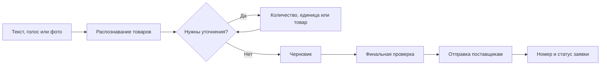
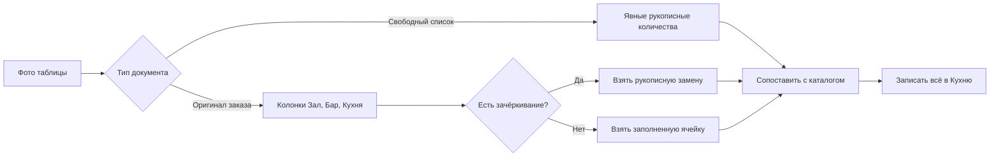
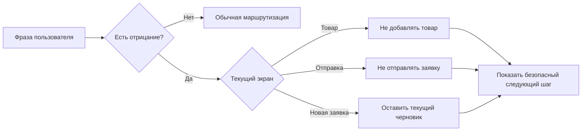
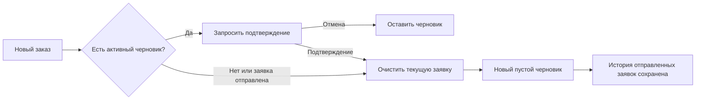

# Пользовательские сценарии AutoSnab

<!-- Сгенерировано из docs/user-scenarios/scenarios.json. Не редактируйте вручную. -->

Этот документ показывает поведение бота языком повара и сотрудника кафе.
Он не заменяет тесты: ссылки в карточках ведут к проверкам реального кода.

## Как пользоваться

1. Найдите нужную ситуацию по разделу или идентификатору.
2. Повторите действие пользователя в Telegram.
3. Сравните ответ бота и итог с ожидаемым поведением.
4. Для удобного просмотра откройте [`user-scenarios/index.html`](user-scenarios/index.html).

## Покрытие

| Показатель | Значение |
|---|---:|
| Всего сценариев | 31 |
| Связаны с pytest | 31 |
| Критические | 20 |
| Важные | 8 |
| Защитные | 3 |

## Основные маршруты

### Обычная заявка

Основной путь сотрудника кафе от первого сообщения до отправленной заявки.

**Проверяется сценариями:** `INP-01`, `INP-02`, `REC-01`, `REC-02`, `REC-03`, `REC-04`, `REC-05`, `REC-06`, `DRF-01`, `SUB-01`, `SUB-02`, `SUB-03`, `SUB-04`

### Фотография таблицы

Количество берётся только из фактически заполненных колонок заказа, а не из фасовки или справочных данных.

**Проверяется сценариями:** `INP-03`, `INP-04`, `INP-05`, `REC-06`, `RCV-02`

### Команда с отрицанием

Отрицание имеет приоритет: бот не должен добавлять, объединять или отправлять вопреки словам пользователя.

**Проверяется сценариями:** `REC-05`, `SAF-01`, `SAF-02`, `SAF-03`

### Новая заявка

После отправки новый заказ начинается сразу, а активный черновик очищается только после подтверждения.

**Проверяется сценариями:** `DRF-04`, `DRF-05`, `SUB-03`

## Каталог сценариев

### Подключение заведения

Первый вход, подтверждение заведения и безопасное переключение между заведениями.

#### REG-01 · Подключение по коду заведения

**Приоритет:** Критический 
**Канал:** Текст, Кнопка 
**Предусловие:** Пользователь ещё не подключён к заведению и находится в личном чате с ботом.

**Действие пользователя:** Отправляет код заведения и подтверждает найденное название.

**Ответ бота:** Показывает название заведения, спрашивает подтверждение и только после согласия сохраняет привязку.

**Результат:** Пользователь получает доступ только к каталогу и таблице выбранного заведения.

**Примеры фраз:**

- «12345»
- «/start 12345»
- «Да, подключить»

**Автоматическая проверка:**

- [`tests/venue/test_venue_registration.py`](../tests/venue/test_venue_registration.py) → `test_all_registration_entry_points_use_one_lookup`
- [`tests/venue/test_venue_registration.py`](../tests/venue/test_venue_registration.py) → `test_successful_binding_is_synced_before_success_is_shown`

#### REG-02 · Отказ или смена заведения

**Приоритет:** Критический 
**Канал:** Текст, Кнопка 
**Предусловие:** Бот предлагает подключить новое заведение либо заменить действующую привязку.

**Действие пользователя:** Отказывается или подтверждает смену заведения.

**Ответ бота:** При отказе ничего не записывает; для смены запрашивает дополнительное подтверждение.

**Результат:** Случайное сообщение или нажатие не переключает пользователя на чужое заведение.

**Примеры фраз:**

- «Нет»
- «Отмена»
- «Да, изменить»

**Автоматическая проверка:**

- [`tests/venue/test_venue_registration.py`](../tests/venue/test_venue_registration.py) → `test_declining_confirmation_never_writes`
- [`tests/venue/test_venue_registration.py`](../tests/venue/test_venue_registration.py) → `test_switch_requires_an_extra_confirmation`

### Добавление товаров

Текст, голос, фотографии таблиц и рукописные списки.

#### INP-01 · Добавление товаров текстом

**Приоритет:** Важный 
**Канал:** Текст 
**Предусловие:** Заведение подключено, каталог доступен.

**Действие пользователя:** Отправляет один товар или список товаров с количеством.

**Ответ бота:** Распознаёт отдельные позиции, сопоставляет их с каталогом и показывает результат.

**Результат:** Найденные товары появляются в черновике с указанным количеством.

**Примеры фраз:**

- «Картофель 5 кг»
- «Сливки 33% — 12 шт»
- «Сироп роза 6 шт
Говядина 5 кг»

**Автоматическая проверка:**

- [`tests/conversation/test_engine.py`](../tests/conversation/test_engine.py) → `test_add_exact_product_to_draft`
- [`tests/ai/test_ai_media.py`](../tests/ai/test_ai_media.py) → `test_hyphenated_multiline_product_list_skips_ai_and_keeps_quantities`

#### INP-02 · Добавление товаров голосом

**Приоритет:** Критический 
**Канал:** Голос 
**Предусловие:** Заведение подключено, Telegram и сервис распознавания голоса доступны.

**Действие пользователя:** Называет товары, количества и комментарии обычной разговорной фразой.

**Ответ бота:** Показывает этап распознавания, превращает речь в позиции и не переносит количество между соседними товарами.

**Результат:** В черновик попадают только произнесённые товары и количества.

**Примеры фраз:**

- «Добавь пять килограммов картофеля»
- «Сыр пармезан два килограмма и сливки десять штук»

**Автоматическая проверка:**

- [`tests/conversation/test_orchestrator_pipeline.py`](../tests/conversation/test_orchestrator_pipeline.py) → `test_voice_pipeline_shows_progress_before_transcription`
- [`tests/input/test_voice_input_contract.py`](../tests/input/test_voice_input_contract.py) → `test_shared_source_line_does_not_copy_last_quantity_to_every_product`

#### INP-03 · Фото оригинальной таблицы заказа

**Приоритет:** Критический 
**Канал:** Фото, Файл-изображение 
**Предусловие:** На фотографии есть таблица заказа с колонками «Зал», «Бар» или «Кухня».

**Действие пользователя:** Отправляет фотографию распечатанной или заполненной таблицы.

**Ответ бота:** Берёт количество только из заполненных колонок заказа, сохраняет комментарии и игнорирует фасовку, остатки и справочные числа.

**Результат:** Распознанное количество записывается в заявку как количество для «Кухни». Строки без заказа не добавляются.

**Примеры фраз:**

- «Распечатанная таблица с количеством в колонке «Бар»»
- «Таблица с заполненными «Зал» и «Кухня»»
- «Фото, где у товара указан комментарий поставщику»

**Автоматическая проверка:**

- [`tests/ai/test_ai_media.py`](../tests/ai/test_ai_media.py) → `test_client_order_sheet_uses_the_selected_department_quantity`
- [`tests/ai/test_ai_media.py`](../tests/ai/test_ai_media.py) → `test_client_order_sheet_sums_only_filled_department_order_cells`
- [`tests/ai/test_photo_prompt_contract.py`](../tests/ai/test_photo_prompt_contract.py) → `test_photo_prompt_excludes_packaging_and_stock_from_order_quantity`

#### INP-04 · Фото рукописного списка

**Приоритет:** Важный 
**Канал:** Фото, Файл-изображение 
**Предусловие:** На фотографии нет стандартной таблицы, но видны названия и явно написанные количества.

**Действие пользователя:** Отправляет фотографию списка, написанного от руки.

**Ответ бота:** Использует только явно указанные количества и сопоставляет названия с каталогом.

**Результат:** Позиции с количеством попадают в черновик; бот не придумывает отсутствующие значения.

**Примеры фраз:**

- «Сироп роза — 6 шт»
- «Говядина — 5 кг»
- «Курица — 1 кг»

**Автоматическая проверка:**

- [`tests/conversation/test_engine.py`](../tests/conversation/test_engine.py) → `test_handwritten_photo_quantity_survives_catalog_matching`
- [`tests/ai/test_ai_media.py`](../tests/ai/test_ai_media.py) → `test_free_list_keeps_explicit_quantity_even_if_model_calls_it_order_column`

#### INP-05 · Зачёркнутое количество и правка ручкой

**Приоритет:** Критический 
**Канал:** Фото 
**Предусловие:** Печатное количество зачёркнуто, рядом написано новое значение.

**Действие пользователя:** Отправляет фотографию таблицы с ручной корректировкой.

**Ответ бота:** Считает зачёркнутое значение недействительным и использует только разборчивую рукописную замену.

**Результат:** В черновике остаётся одно актуальное количество без сложения со старым.

**Примеры фраз:**

- «5 зачёркнуто, рядом написано 7»
- «100 кг зачёркнуто, от руки указано 10 шт»

**Автоматическая проверка:**

- [`tests/ai/test_ai_media.py`](../tests/ai/test_ai_media.py) → `test_handwritten_replacement_wins_over_crossed_out_client_sheet_quantity`
- [`tests/conversation/test_engine.py`](../tests/conversation/test_engine.py) → `test_crossed_out_photo_quantity_uses_only_handwritten_replacement`

### Уточнение товаров

Количество, единицы, комментарии, дубликаты и выбор подходящего товара.

#### REC-01 · Не указано количество

**Приоритет:** Критический 
**Канал:** Текст, Голос, Фото 
**Предусловие:** Товар найден в каталоге, но положительное количество отсутствует.

**Действие пользователя:** Отправляет название без количества, затем отвечает числом.

**Ответ бота:** Просит уточнить количество именно для текущего товара и не создаёт новую строку.

**Результат:** После ответа товар один раз появляется в черновике с введённым количеством.

**Примеры фраз:**

- «Сыр пармезан»
- «Нужно 5 кг»
- «Пять»

**Автоматическая проверка:**

- [`tests/conversation/test_engine.py`](../tests/conversation/test_engine.py) → `test_missing_quantity_starts_clarification`
- [`tests/quantity/test_quantity_flow.py`](../tests/quantity/test_quantity_flow.py) → `test_quantity_answer_completes_current_missing_item_without_new_cart_line`

#### REC-02 · Единица не совпадает с каталогом

**Приоритет:** Критический 
**Канал:** Текст, Голос, Кнопка 
**Предусловие:** Пользователь указал килограммы для товара, который заказывается в штуках, или наоборот.

**Действие пользователя:** Выбирает единицу каталога либо вводит корректное количество.

**Ответ бота:** Не меняет единицу молча, показывает различие и предлагает безопасные варианты.

**Результат:** В черновике хранится количество в допустимой единице каталога.

**Примеры фраз:**

- «Сыр Швейцарский 100 кг»
- «Используй как в каталоге»
- «Нужно 10 штук»

**Автоматическая проверка:**

- [`tests/quantity/test_unit_handling.py`](../tests/quantity/test_unit_handling.py) → `test_incompatible_unit_requires_confirmation_instead_of_silent_change`
- [`tests/quantity/test_voice_quantity_context.py`](../tests/quantity/test_voice_quantity_context.py) → `test_voice_unit_mismatch_accepts_catalog_unit_and_spoken_quantity`

#### REC-03 · Несколько похожих товаров

**Приоритет:** Критический 
**Канал:** Текст, Голос, Кнопка 
**Предусловие:** По названию найдено несколько подходящих строк каталога.

**Действие пользователя:** Выбирает номер, кнопку или однозначное название варианта.

**Ответ бота:** Показывает кандидатов и не выбирает первый вариант автоматически.

**Результат:** В черновик попадает только явно выбранный товар.

**Примеры фраз:**

- «Первый вариант»
- «Выбираю второй»
- «Сироп роза»

**Автоматическая проверка:**

- [`tests/catalog/test_candidate_selection.py`](../tests/catalog/test_candidate_selection.py) → `test_explicit_candidate_selection_uses_selected_catalog_row`
- [`tests/catalog/test_candidate_selection.py`](../tests/catalog/test_candidate_selection.py) → `test_common_candidate_word_does_not_silently_choose_a_product`

#### REC-04 · Товар не найден в каталоге

**Приоритет:** Важный 
**Канал:** Текст, Голос, Кнопка 
**Предусловие:** Ни один товар каталога не подходит достаточно уверенно.

**Действие пользователя:** Меняет название, ищет у всех поставщиков, не добавляет позицию или отправляет запрос снабженцу.

**Ответ бота:** Показывает понятные варианты и не подставляет случайный товар.

**Результат:** Неизвестная позиция не загрязняет заявку; запрос снабженцу хранится отдельно от черновика.

**Примеры фраз:**

- «Изменить название»
- «Искать у всех поставщиков»
- «Отправить запрос снабженцу»

**Автоматическая проверка:**

- [`tests/catalog/test_candidate_selection.py`](../tests/catalog/test_candidate_selection.py) → `test_not_found_product_uses_human_copy_for_text_and_voice`
- [`tests/product_add/test_product_add.py`](../tests/product_add/test_product_add.py) → `test_product_add_request_list_keeps_request_separate_from_cart`

#### REC-05 · Повтор уже добавленного товара

**Приоритет:** Критический 
**Канал:** Текст, Голос, Кнопка 
**Предусловие:** В черновике уже есть такой же товар.

**Действие пользователя:** Подтверждает прибавление нового количества или отказывается от повторного добавления.

**Ответ бота:** Показывает текущее и итоговое количество; без подтверждения значения не складывает.

**Результат:** Количество увеличивается ровно на подтверждённое значение либо остаётся прежним.

**Примеры фраз:**

- «Добавить — будет 15 кг»
- «Не добавлять повторно»
- «Не объединяй»

**Автоматическая проверка:**

- [`tests/quantity/test_duplicate_quantity.py`](../tests/quantity/test_duplicate_quantity.py) → `test_duplicate_merge_adds_only_the_confirmed_increment`
- [`tests/conversation/test_voice_route_safety.py`](../tests/conversation/test_voice_route_safety.py) → `test_negative_duplicate_phrases_never_merge_quantities`

#### REC-06 · Комментарий к товару или ко всей заявке

**Приоритет:** Важный 
**Канал:** Текст, Голос, Фото 
**Предусловие:** Пользователь добавляет пожелание после товара или явно задаёт общий комментарий.

**Действие пользователя:** Сообщает сорт, качество, упаковку, дату доставки или другое пожелание.

**Ответ бота:** Отделяет комментарий от названия и сохраняет его до отправки.

**Результат:** Комментарий попадает в нужную строку Google Sheets и не превращается в отдельный товар.

**Примеры фраз:**

- «Говядина 5 кг, обязательно мраморная»
- «Сливки 12 шт, по 1 литру»
- «Комментарий ко всей заявке: привезти утром»

**Автоматическая проверка:**

- [`tests/conversation/test_comment_handling.py`](../tests/conversation/test_comment_handling.py) → `test_comment_is_not_part_of_product_name_and_reaches_submission_row`
- [`tests/conversation/test_comment_handling.py`](../tests/conversation/test_comment_handling.py) → `test_global_comment_is_appended_to_every_item_comment_and_order_row`

### Работа с черновиком

Просмотр, продолжение, очистка и начало новой заявки.

#### DRF-01 · Показать текущий черновик

**Приоритет:** Важный 
**Канал:** Текст, Голос, Кнопка 
**Предусловие:** Пользователь находится на любом шаге диалога.

**Действие пользователя:** Просит показать заявку или возвращается кнопкой.

**Ответ бота:** Открывает актуальный черновик, не добавляя слова команды как товар.

**Результат:** Пользователь видит текущие позиции, количества и доступные действия.

**Примеры фраз:**

- «Покажи черновик»
- «Что у меня в заявке?»
- «Вернись в корзину»

**Автоматическая проверка:**

- [`tests/conversation/test_global_voice_navigation.py`](../tests/conversation/test_global_voice_navigation.py) → `test_global_voice_show_cart_works_from_every_stage`
- [`tests/input/test_voice_route_matrix.py`](../tests/input/test_voice_route_matrix.py) → `test_free_form_navigation_does_not_consume_real_product_names`

#### DRF-02 · Продолжить добавление товаров

**Приоритет:** Важный 
**Канал:** Текст, Голос, Кнопка 
**Предусловие:** В черновике уже есть обработанные позиции.

**Действие пользователя:** Просит добавить ещё товары и отправляет следующий список.

**Ответ бота:** Переходит в режим добавления, сохраняя существующий черновик.

**Результат:** Новые позиции добавляются к текущей заявке.

**Примеры фраз:**

- «Добавить ещё товары»
- «Давай внесём ещё что-нибудь»
- «Хочу еще позиции»

**Автоматическая проверка:**

- [`tests/input/test_voice_route_matrix.py`](../tests/input/test_voice_route_matrix.py) → `test_live_voice_wording_routes_before_product_parsing`
- [`tests/conversation/test_add_more_prompt.py`](../tests/conversation/test_add_more_prompt.py) → `test_successful_addition_asks_whether_to_add_more`

#### DRF-03 · Очистить текущую заявку

**Приоритет:** Критический 
**Канал:** Текст, Голос, Кнопка 
**Предусловие:** В черновике есть товары или незавершённые уточнения.

**Действие пользователя:** Явно просит полностью очистить заявку.

**Ответ бота:** Удаляет только текущий черновик и возвращает экран новой заявки.

**Результат:** Черновик пуст; история ранее отправленных заявок не удаляется.

**Примеры фраз:**

- «Очисти заявку»
- «Удали всё из корзины»
- «Сбрось черновик»

**Автоматическая проверка:**

- [`tests/conversation/test_state_transitions.py`](../tests/conversation/test_state_transitions.py) → `test_clear_cart_removes_draft_and_returns_to_collecting`

#### DRF-04 · Новая заявка при активном черновике

**Приоритет:** Критический 
**Канал:** Текст, Голос, Кнопка 
**Предусловие:** Текущая заявка ещё не отправлена и содержит товары.

**Действие пользователя:** Говорит «новый заказ», затем подтверждает или отменяет очистку.

**Ответ бота:** Предупреждает о сохранённом черновике и не очищает его без отдельного подтверждения.

**Результат:** При подтверждении открывается пустая заявка; при отказе старый черновик сохраняется.

**Примеры фраз:**

- «Новый заказ»
- «Да, начать новую»
- «Нет, оставить черновик»

**Автоматическая проверка:**

- [`tests/conversation/test_new_order_flow.py`](../tests/conversation/test_new_order_flow.py) → `test_new_order_with_active_draft_requires_confirmation`
- [`tests/conversation/test_new_order_flow.py`](../tests/conversation/test_new_order_flow.py) → `test_rejecting_new_order_keeps_active_draft`

#### DRF-05 · Новая заявка после отправки

**Приоритет:** Критический 
**Канал:** Текст, Голос, Кнопка 
**Предусловие:** Предыдущая заявка успешно отправлена.

**Действие пользователя:** Говорит «новый заказ» или нажимает кнопку «Новая заявка».

**Ответ бота:** Сразу открывает пустой черновик без лишнего подтверждения.

**Результат:** История и номер предыдущей заявки сохраняются, новая заявка начинается с нуля.

**Примеры фраз:**

- «Новый заказ»
- «Хочу оформить ещё одну заявку»
- «Новая заявка»

**Автоматическая проверка:**

- [`tests/conversation/test_new_order_flow.py`](../tests/conversation/test_new_order_flow.py) → `test_new_order_after_submission_starts_empty_draft_and_preserves_history`
- [`tests/conversation/test_new_order_flow.py`](../tests/conversation/test_new_order_flow.py) → `test_success_card_new_order_callback_preserves_tracking`

### Проверка и отправка

Минимальная сумма, подтверждение, отправка и просмотр статуса.

#### SUB-01 · Переход к финальной проверке

**Приоритет:** Критический 
**Канал:** Текст, Голос, Кнопка 
**Предусловие:** В черновике есть товары.

**Действие пользователя:** Просит оформить или отправить заявку.

**Ответ бота:** Сначала проверяет незавершённые позиции и показывает итоговую карточку.

**Результат:** До явного финального подтверждения внешняя отправка не запускается.

**Примеры фраз:**

- «Оформи заявку»
- «Я всё добавил»
- «Перейти к проверке заявки»

**Автоматическая проверка:**

- [`tests/conversation/test_state_transitions.py`](../tests/conversation/test_state_transitions.py) → `test_submit_request_opens_final_review_without_enqueuing`
- [`tests/submission/test_submission_guards.py`](../tests/submission/test_submission_guards.py) → `test_submit_request_stops_on_first_unresolved_item`

#### SUB-02 · Не набрана минимальная сумма поставщика

**Приоритет:** Важный 
**Канал:** Текст, Голос, Кнопка 
**Предусловие:** Хотя бы у одного поставщика сумма заказа меньше минимальной.

**Действие пользователя:** Открывает предупреждение и выбирает: добавить товары либо принять риск.

**Ответ бота:** Показывает поставщика и недостающую сумму, предлагает понятные действия.

**Результат:** Пользователь осознанно дополняет заявку или отправляет её как есть.

**Примеры фраз:**

- «Проверь минималку»
- «Добавить товары поставщика»
- «Отправить как есть»

**Автоматическая проверка:**

- [`tests/supplier/test_supplier_minimum.py`](../tests/supplier/test_supplier_minimum.py) → `test_supplier_minimum_warning_shows_gap_and_recovery_actions`

#### SUB-03 · Успешная отправка и номер заявки

**Приоритет:** Критический 
**Канал:** Кнопка 
**Предусловие:** Все обязательные уточнения завершены, пользователь подтверждает отправку.

**Действие пользователя:** Нажимает «Отправить поставщику».

**Ответ бота:** Записывает заявку, очищает отправленный черновик и показывает номер с кнопками статуса и новой заявки.

**Результат:** Каждая позиция записана один раз; пользователь видит подтверждение.

**Примеры фраз:**

- «Отправить поставщику»
- «Проверить статус»
- «Новая заявка»

**Автоматическая проверка:**

- [`tests/submission/test_submission.py`](../tests/submission/test_submission.py) → `test_successful_submission_clears_cart_checkpoint_and_marks_state_submitted`
- [`tests/submission/test_submission.py`](../tests/submission/test_submission.py) → `test_submission_success_card_matches_n8n`

#### SUB-04 · Статус отправленных заявок

**Приоритет:** Важный 
**Канал:** Текст, Голос, Кнопка 
**Предусловие:** У пользователя есть хотя бы одна отправленная заявка.

**Действие пользователя:** Просит показать статусы.

**Ответ бота:** Показывает последние отслеживаемые заявки, сгруппированные по номеру.

**Результат:** Пользователь видит статус и дату доставки, не затрагивая текущий черновик.

**Примеры фраз:**

- «Проверь статус последней заявки»
- «Мои заявки»
- «Заявка ушла?»

**Автоматическая проверка:**

- [`tests/submission/test_submission.py`](../tests/submission/test_submission.py) → `test_order_status_renderer_groups_rows_by_order_number`
- [`tests/submission/test_submission.py`](../tests/submission/test_submission.py) → `test_order_status_limits_to_ten_tracked_orders_and_formats_delivery_date`

#### SUB-05 · Временный сбой при отправке

**Приоритет:** Критический 
**Канал:** Системный 
**Предусловие:** Telegram, Google Sheets или сеть временно не отвечают.

**Действие пользователя:** Ждёт результат либо повторяет действие после сообщения об ошибке.

**Ответ бота:** Безопасно повторяет только допустимый этап и не создаёт вторую заявку.

**Результат:** Успешно записанная заявка не дублируется; подтверждённая ошибка отображается после исчерпания повторов.

**Примеры фраз:**

- «Повторить отправку»
- «К черновику»

**Автоматическая проверка:**

- [`tests/submission/test_submission.py`](../tests/submission/test_submission.py) → `test_transient_submission_error_is_retried_without_premature_failure_card`
- [`tests/submission/test_submission.py`](../tests/submission/test_submission.py) → `test_retry_delivers_success_card_after_order_was_already_finalized`

### Защита от неверного действия

Отрицания, устаревшие кнопки и фразы, которые нельзя маршрутизировать ошибочно.

#### SAF-01 · «Не добавляй» не добавляет товар

**Приоритет:** Критический 
**Канал:** Текст, Голос 
**Предусловие:** Бот уточняет товар, единицу, дубликат или запрос снабженцу.

**Действие пользователя:** Отказывается от текущей позиции естественной фразой.

**Ответ бота:** Пропускает только текущую позицию и не воспринимает отрицание как подтверждение.

**Результат:** Товар не появляется в черновике, остальные позиции сохраняются.

**Примеры фраз:**

- «Не добавляй эту позицию»
- «Убери этот товар»
- «Нет, это не нужно»

**Автоматическая проверка:**

- [`tests/conversation/test_voice_route_safety.py`](../tests/conversation/test_voice_route_safety.py) → `test_negative_item_phrases_skip_unit_mismatch_without_confirming_quantity`
- [`tests/input/test_voice_route_matrix.py`](../tests/input/test_voice_route_matrix.py) → `test_common_text_and_voice_phrasings_are_deterministic`

#### SAF-02 · «Не отправляй» отменяет отправку

**Приоритет:** Критический 
**Канал:** Текст, Голос 
**Предусловие:** Пользователь находится на финальной проверке или подтверждении отправки.

**Действие пользователя:** Отказывается от отправки.

**Ответ бота:** Возвращает к безопасному экрану и не ставит задачу отправки.

**Результат:** Google Sheets не изменяется, черновик остаётся доступным.

**Примеры фраз:**

- «Не отправляй»
- «Нет, не надо отправлять»
- «Я передумал»

**Автоматическая проверка:**

- [`tests/conversation/test_voice_route_safety.py`](../tests/conversation/test_voice_route_safety.py) → `test_negative_submit_phrases_never_submit_order`

#### SAF-03 · Отрицание не запускает новую заявку

**Приоритет:** Критический 
**Канал:** Текст, Голос 
**Предусловие:** У пользователя есть активный или отправленный заказ.

**Действие пользователя:** Произносит фразу с отрицанием либо товар, в названии которого встречаются командные слова.

**Ответ бота:** Учитывает отрицание и контекст; не очищает заявку и не маршрутизирует товар как команду.

**Результат:** Состояние заявки не меняется ошибочно.

**Примеры фраз:**

- «Не начинай новый заказ»
- «Новый картофель 5 кг»
- «Не хочу новую заявку»

**Автоматическая проверка:**

- [`tests/input/test_voice_route_matrix.py`](../tests/input/test_voice_route_matrix.py) → `test_new_order_navigation_does_not_override_negation_or_product_quantity`
- [`tests/input/test_voice_route_matrix.py`](../tests/input/test_voice_route_matrix.py) → `test_command_words_inside_product_lines_remain_products`

#### SAF-04 · Устаревшая кнопка не меняет черновик

**Приоритет:** Критический 
**Канал:** Кнопка 
**Предусловие:** Пользователь нажимает кнопку из старого сообщения после изменения заявки.

**Действие пользователя:** Нажимает ранее показанный вариант товара или действие.

**Ответ бота:** Проверяет ревизию состояния и отклоняет устаревшее действие.

**Результат:** Актуальный черновик остаётся неизменным.

**Примеры фраз:**

- «Нажатие старой кнопки выбора»
- «Повторное нажатие после обновления карточки»

**Автоматическая проверка:**

- [`tests/telegram/test_callback_contract.py`](../tests/telegram/test_callback_contract.py) → `test_stale_callback_cannot_mutate_current_draft`

### Сбои и восстановление

Понятное и безопасное поведение при недоступности внешних сервисов.

#### RCV-01 · Голос не удалось распознать

**Приоритет:** Защитный 
**Канал:** Голос 
**Предусловие:** Основная транскрипция пустая либо аудио не содержит понятной команды.

**Действие пользователя:** Отправляет голосовое сообщение.

**Ответ бота:** Использует резервную модель, а при пустом результате просит повторить или написать текстом.

**Результат:** Пустая транскрипция не выбирает товар и не меняет черновик.

**Примеры фраз:**

- «Неразборчивое аудио»
- «Тихая запись»
- «Пустая голосовая команда»

**Автоматическая проверка:**

- [`tests/ai/test_ai_media.py`](../tests/ai/test_ai_media.py) → `test_voice_transcription_uses_fallback_when_primary_returns_empty`
- [`tests/input/test_voice_input_contract.py`](../tests/input/test_voice_input_contract.py) → `test_empty_voice_add_items_uses_the_source_recovery_card`

#### RCV-02 · На фото нет заполненных количеств

**Приоритет:** Критический 
**Канал:** Фото, Файл-изображение 
**Предусловие:** На фотографии видны названия и справочные числа, но нет заполненного заказа.

**Действие пользователя:** Отправляет такую фотографию.

**Ответ бота:** Не использует фасовку, остаток или случайное число как количество заказа.

**Результат:** В черновик не добавляются строки без доказанного положительного количества.

**Примеры фраз:**

- «Пустой бланк заказа»
- «Таблица только с фасовкой»
- «Фото без рукописных количеств»

**Автоматическая проверка:**

- [`tests/ai/test_ai_media.py`](../tests/ai/test_ai_media.py) → `test_photo_drops_every_item_without_actual_order_quantity`
- [`tests/conversation/test_engine.py`](../tests/conversation/test_engine.py) → `test_photo_without_order_quantities_does_not_create_draft_items`

#### RCV-03 · Недоступен справочник заведений

**Приоритет:** Защитный 
**Канал:** Текст 
**Предусловие:** Справочник не настроен или временно недоступен.

**Действие пользователя:** Отправляет код подключения.

**Ответ бота:** Сообщает, что код сейчас не удалось проверить, и предлагает повторить позже.

**Результат:** Бот не создаёт ложную привязку и не показывает технический traceback пользователю.

**Примеры фраз:**

- «12345»
- «/start 12345»

**Автоматическая проверка:**

- [`tests/venue/test_venue_registration.py`](../tests/venue/test_venue_registration.py) → `test_directory_reports_missing_configuration_before_http_call`
- [`tests/venue/test_venue_registration.py`](../tests/venue/test_venue_registration.py) → `test_directory_does_not_cache_transport_errors`

#### RCV-04 · Общая ошибка обработки сообщения

**Приоритет:** Защитный 
**Канал:** Текст, Голос, Фото 
**Предусловие:** Во время обработки возникает непредвиденная техническая ошибка.

**Действие пользователя:** Отправляет сообщение любого поддерживаемого типа.

**Ответ бота:** Фиксирует безопасную контрольную точку и показывает короткое сообщение без внутренних данных.

**Результат:** Пользователь может повторить действие; секреты и traceback не попадают в обычный ответ.

**Примеры фраз:**

- «Повторить сообщение»
- «Открыть черновик после ошибки»

**Автоматическая проверка:**

- [`tests/conversation/test_orchestrator_pipeline.py`](../tests/conversation/test_orchestrator_pipeline.py) → `test_pipeline_failure_is_checkpointed_and_user_gets_safe_reply`
- [`tests/conversation/test_orchestrator_pipeline.py`](../tests/conversation/test_orchestrator_pipeline.py) → `test_checkpointed_result_retries_only_telegram_delivery`

## Обозначения

- **Критический** — ошибка приводит к неверной заявке, потере данных или отправке против воли пользователя.
- **Важный** — основной рабочий путь сотрудника кафе.
- **Защитный** — обработка неоднозначности, сбоя или ошибочного действия.

_Версия каталога: 1.1. Категорий: 7._
