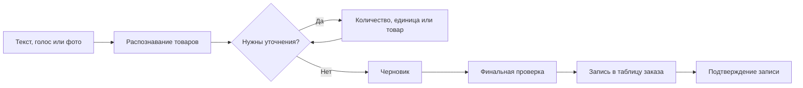
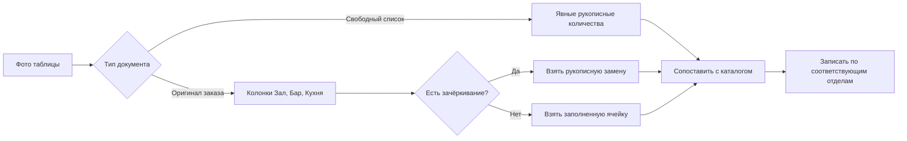
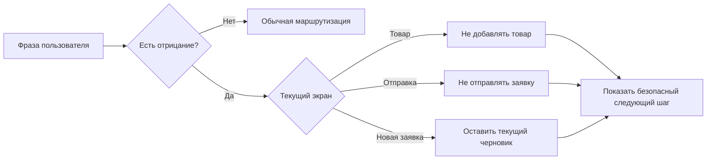
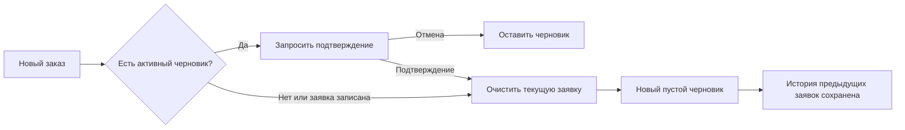
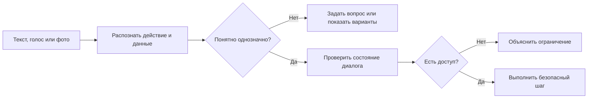
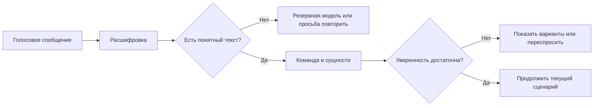
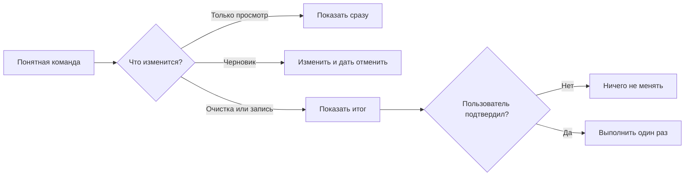
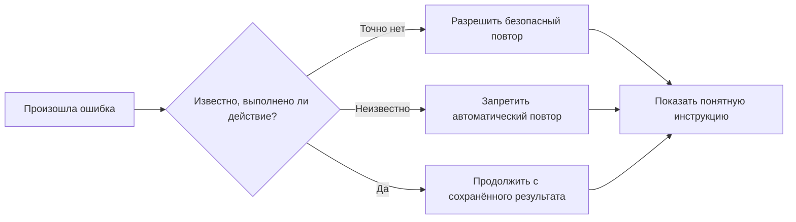
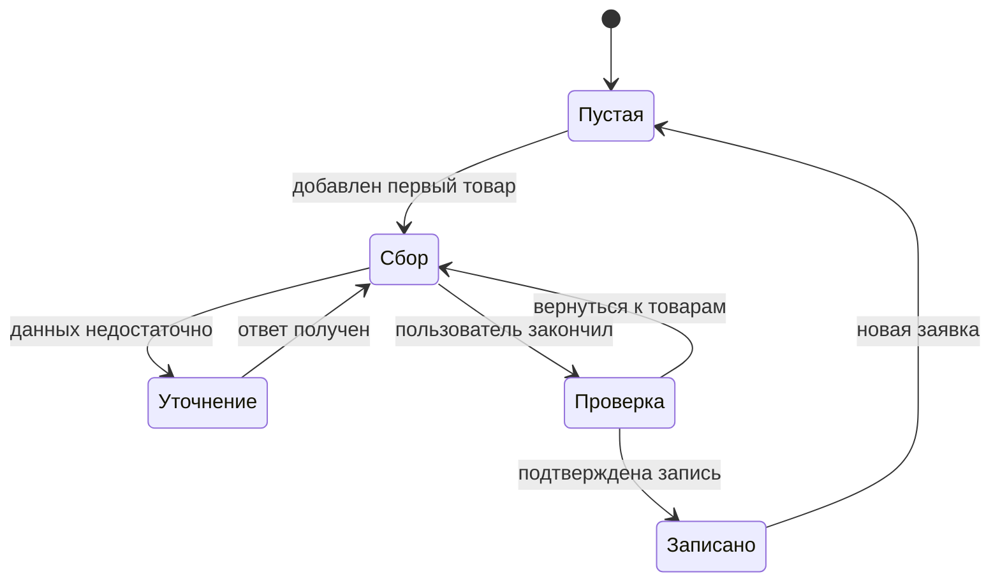

# Пользовательские сценарии AutoSnab

<!-- Сгенерировано из docs/user-scenarios/scenarios.json. Не редактируйте вручную. -->

Этот документ показывает поведение бота языком повара и сотрудника кафе.
Он не заменяет тесты: ссылки в карточках ведут к проверкам реального кода.

## Как пользоваться

1. Найдите нужную ситуацию по разделу или идентификатору.
2. Повторите действие пользователя в Telegram.
3. Сравните ответ бота и итог с ожидаемым поведением.
4. Для удобного просмотра откройте [`user-scenarios/index.html`](user-scenarios/index.html).

## Главные правила

### Бот не угадывает

Если товар, количество, единица или команда неоднозначны, бот задаёт вопрос или показывает варианты.

### Сначала черновик

Текст, голос и фото изменяют только текущий черновик. В таблицу заказ попадает после финальной проверки.

### Отрицание важнее команды

Фразы «не добавляй», «не отправляй» и похожие отменяют текущее действие, а не подтверждают его.

### Опасные действия подтверждаются

Очистка черновика и запись заявки в таблицу не выполняются без понятного подтверждения пользователя.

### Ошибка не портит заявку

При сбое бот сохраняет безопасное состояние и не повторяет действие, если есть риск создать дубль.

## Покрытие

| Показатель | Значение |
|---|---:|
| Всего сценариев | 41 |
| Связаны с pytest | 41 |
| Критические | 26 |
| Важные | 12 |
| Защитные | 3 |

## Основные маршруты

### Обычная заявка

Основной путь сотрудника кафе от первого сообщения до записи заявки в таблицу заказа.

**Проверяется сценариями:** `INP-01`, `INP-02`, `REC-01`, `REC-02`, `REC-03`, `REC-04`, `REC-05`, `REC-06`, `DRF-01`, `SUB-01`, `SUB-02`, `SUB-03`, `SUB-04`, `REC-07`, `REC-08`, `REC-09`, `REC-10`, `SUB-06`

### Фотография таблицы

Количество берётся только из фактически заполненных колонок заказа, а не из фасовки или справочных данных.

**Проверяется сценариями:** `INP-03`, `INP-04`, `INP-05`, `REC-06`, `RCV-02`

### Команда с отрицанием

Отрицание имеет приоритет: бот не должен добавлять, объединять или отправлять вопреки словам пользователя.

**Проверяется сценариями:** `REC-05`, `SAF-01`, `SAF-02`, `SAF-03`

### Новая заявка

После записи заявки новый заказ начинается сразу, а активный черновик очищается только после подтверждения.

**Проверяется сценариями:** `DRF-04`, `DRF-05`, `SUB-03`

## Как бот принимает решения

### Как бот понимает сообщение

Канал ввода меняется, но решение всегда зависит от смысла фразы и текущего состояния диалога.

**Связанные сценарии:** `INP-01`, `INP-02`, `INP-03`, `DRF-01`, `SUB-01`, `SAF-01`

### Голосовое сообщение

Бот сначала получает расшифровку, затем обрабатывает её так же, как обычный человеческий текст.

**Связанные сценарии:** `INP-02`, `REC-01`, `REC-02`, `REC-03`, `RCV-01`

### Когда требуется подтверждение

Просмотр выполняется сразу, работа с черновиком обратима, а запись или очистка требуют явного согласия.

**Связанные сценарии:** `REG-02`, `REC-05`, `DRF-03`, `DRF-04`, `SUB-02`, `SUB-03`

### Ошибка и восстановление

Бот возвращает пользователя к безопасной точке и не повторяет действие, если результат предыдущей попытки неизвестен.

**Связанные сценарии:** `SUB-05`, `RCV-01`, `RCV-02`, `RCV-03`, `RCV-04`, `REC-09`, `SUB-06`, `SAF-05`

### Состояния заявки

Каждая команда обрабатывается с учётом текущего этапа, поэтому одинаковая фраза не должна запускать неверное действие.

**Связанные сценарии:** `DRF-01`, `DRF-02`, `DRF-03`, `DRF-04`, `SUB-01`, `SUB-03`, `HIS-01`, `SAF-04`, `SAF-05`

## Каталог сценариев

### Подключение заведения

Первый вход, подтверждение заведения и безопасное переключение между заведениями.

**Доступ:** Личный чат и активная строка типа «Заведение» в реестре подключений.
**Что распознаём:** код заведения, название заведения, пользователь
**Подтверждение:** Нужно перед созданием или заменой привязки к заведению.
**Если произошла ошибка:** Не сохранять привязку, объяснить причину и предложить повторить проверку кода.

#### REG-01 · Подключение по коду заведения

**Приоритет:** Критический 
**Статус:** Работает сейчас 
**Канал:** Текст, Кнопка 
**Предусловие:** Пользователь ещё не подключён к заведению и находится в личном чате с ботом.

**Действие пользователя:** Отправляет код заведения и подтверждает найденное название.

**Ответ бота:** Показывает название заведения, спрашивает подтверждение и только после согласия сохраняет привязку.

**Результат:** Пользователь получает доступ только к каталогу и таблице выбранного заведения.

**Статус проверки:** `AUTOMATED_PASS` — Контракт полностью подтверждён локальными автоматическими тестами

**Ручная проверка:** Не требуется для подтверждения локального контракта; общий Telegram smoke выполняется перед пилотом.

<strong>Что важно для системы</strong>

- **Доступ:** Личный чат и активная строка типа «Заведение» в реестре подключений.
- **Распознаваем:** код заведения, название заведения, пользователь
- **Подтверждение:** Нужно перед созданием или заменой привязки к заведению.
- **Изменение состояния:** Пользователь получает доступ только к каталогу и таблице выбранного заведения.
- **Восстановление:** Не сохранять привязку, объяснить причину и предложить повторить проверку кода.

**Примеры фраз:**

- «12345»
- «/start 12345»
- «Да, подключить»

**Автоматическая проверка:**

- [`tests/venue/test_venue_registration.py`](../tests/venue/test_venue_registration.py) → `test_all_registration_entry_points_use_one_lookup`
- [`tests/venue/test_venue_registration.py`](../tests/venue/test_venue_registration.py) → `test_successful_binding_is_synced_before_success_is_shown`

#### REG-02 · Отказ или смена заведения

**Приоритет:** Критический 
**Статус:** Работает сейчас 
**Канал:** Текст, Кнопка 
**Предусловие:** Бот предлагает подключить новое заведение либо заменить действующую привязку.

**Действие пользователя:** Отказывается или подтверждает смену заведения.

**Ответ бота:** При отказе ничего не записывает; для смены запрашивает дополнительное подтверждение.

**Результат:** Случайное сообщение или нажатие не переключает пользователя на чужое заведение.

**Статус проверки:** `AUTOMATED_PASS` — Контракт полностью подтверждён локальными автоматическими тестами

**Ручная проверка:** Не требуется для подтверждения локального контракта; общий Telegram smoke выполняется перед пилотом.

<strong>Что важно для системы</strong>

- **Доступ:** Личный чат и активная строка типа «Заведение» в реестре подключений.
- **Распознаваем:** код заведения, название заведения, пользователь
- **Подтверждение:** Нужно перед созданием или заменой привязки к заведению.
- **Изменение состояния:** Случайное сообщение или нажатие не переключает пользователя на чужое заведение.
- **Восстановление:** Не сохранять привязку, объяснить причину и предложить повторить проверку кода.

**Примеры фраз:**

- «Нет»
- «Отмена»
- «Да, изменить»

**Автоматическая проверка:**

- [`tests/venue/test_venue_registration.py`](../tests/venue/test_venue_registration.py) → `test_declining_confirmation_never_writes`
- [`tests/venue/test_venue_registration.py`](../tests/venue/test_venue_registration.py) → `test_switch_requires_an_extra_confirmation`

#### REG-03 · Управление доступом через таблицу

**Приоритет:** Критический 
**Статус:** Работает сейчас 
**Канал:** Текст, Голос, Фото, Кнопка 
**Предусловие:** Пользователь ранее подключён к заведению, а его строка с типом компании «Заведение» находится в центральном листе «Чаты».

**Действие пользователя:** Отправляет боту сообщение после того, как ответственный сотрудник изменил поле «Активен» или удалил строку.

**Ответ бота:** При TRUE продолжает работу. При FALSE или отсутствии строки сообщает, что доступ отключён, и не читает и не изменяет таблицу заведения.

**Результат:** Доступ каждого пользователя управляется строкой типа «Заведение»; строки поставщиков не дают доступ к ресторану. Повторное TRUE восстанавливает доступ. Временный сбой Google не блокирует ранее подтверждённых пользователей.

**Статус проверки:** `AUTOMATED_PARTIAL` — Основной контракт подтверждён, но реальный внешний контур не проверен

**Ручная проверка:** Нужен live-прогон с тестовым реестром Google Sheets: отзыв и восстановление доступа.

<strong>Что важно для системы</strong>

- **Доступ:** Личный чат и активная строка типа «Заведение» в реестре подключений.
- **Распознаваем:** код заведения, название заведения, пользователь
- **Подтверждение:** Нужно перед созданием или заменой привязки к заведению.
- **Изменение состояния:** Доступ каждого пользователя управляется строкой типа «Заведение»; строки поставщиков не дают доступ к ресторану. Повторное TRUE восстанавливает доступ. Временный сбой Google не блокирует ранее подтверждённых пользователей.
- **Восстановление:** Не сохранять привязку, объяснить причину и предложить повторить проверку кода.

**Примеры фраз:**

- «Тип компании = Заведение»
- «Активен = TRUE»
- «Активен = FALSE»
- «Строка пользователя удалена»

**Автоматическая проверка:**

- [`tests/venue/test_venue_registration.py`](../tests/venue/test_venue_registration.py) → `test_access_registry_denies_missing_inactive_or_conflicting_rows`
- [`tests/venue/test_venue_registration.py`](../tests/venue/test_venue_registration.py) → `test_context_revokes_access_removed_from_central_table`
- [`tests/venue/test_venue_registration.py`](../tests/venue/test_venue_registration.py) → `test_context_restores_access_reenabled_in_central_table`
- [`tests/submission/test_submission.py`](../tests/submission/test_submission.py) → `test_revoked_access_stops_submission_before_google_write`

### Добавление товаров

Текст, голос, фотографии таблиц и рукописные списки.

**Доступ:** Пользователь подключён к активному заведению.
**Что распознаём:** товар, количество, единица, поставщик, комментарий
**Подтверждение:** Не нужно для понятной позиции: товар добавляется только в черновик. Неоднозначность требует уточнения.
**Если произошла ошибка:** Сохранить уже распознанные позиции и попросить повторить только непонятную часть.

#### INP-01 · Добавление товаров текстом

**Приоритет:** Важный 
**Статус:** Работает сейчас 
**Канал:** Текст 
**Предусловие:** Заведение подключено, каталог доступен.

**Действие пользователя:** Отправляет один товар или список товаров с количеством.

**Ответ бота:** Распознаёт отдельные позиции, сопоставляет их с каталогом и показывает результат.

**Результат:** Найденные товары появляются в черновике с указанным количеством.

**Статус проверки:** `AUTOMATED_PASS` — Контракт полностью подтверждён локальными автоматическими тестами

**Ручная проверка:** Не требуется для подтверждения локального контракта; общий Telegram smoke выполняется перед пилотом.

<strong>Что важно для системы</strong>

- **Доступ:** Пользователь подключён к активному заведению.
- **Распознаваем:** товар, количество, единица, поставщик, комментарий
- **Подтверждение:** Не нужно для понятной позиции: товар добавляется только в черновик. Неоднозначность требует уточнения.
- **Изменение состояния:** Найденные товары появляются в черновике с указанным количеством.
- **Восстановление:** Сохранить уже распознанные позиции и попросить повторить только непонятную часть.

**Примеры фраз:**

- «Картофель 5 кг»
- «Сливки 33% — 12 шт»
- «Сироп роза 6 шт
Говядина 5 кг»

**Автоматическая проверка:**

- [`tests/conversation/test_engine.py`](../tests/conversation/test_engine.py) → `test_add_exact_product_to_draft`
- [`tests/ai/test_ai_media.py`](../tests/ai/test_ai_media.py) → `test_hyphenated_multiline_product_list_skips_ai_and_keeps_quantities`

#### INP-02 · Добавление товаров голосом

**Приоритет:** Критический 
**Статус:** Работает сейчас 
**Канал:** Голос 
**Предусловие:** Заведение подключено, Telegram и сервис распознавания голоса доступны.

**Действие пользователя:** Называет товары, количества и комментарии обычной разговорной фразой, а на карточке уточнения отвечает коротко: «одна бутылка», «ладно, бутылка», «десять килограммов».

**Ответ бота:** Показывает этап распознавания, превращает речь в позиции, связывает короткий ответ с текущим товаром и не переносит количество между соседними товарами.

**Результат:** В черновик попадают только произнесённые товары и количества. Диапазон размера или фасовка вроде «0,8–1,2 кг» остаётся характеристикой товара и не становится количеством заказа.

**Статус проверки:** `AUTOMATED_PARTIAL` — Основной контракт подтверждён, но реальный внешний контур не проверен

**Ручная проверка:** Нужен live-прогон в Telegram с реальным аудио и основной/резервной ASR-моделью.

<strong>Что важно для системы</strong>

- **Доступ:** Пользователь подключён к активному заведению.
- **Распознаваем:** товар, количество, единица, поставщик, комментарий
- **Подтверждение:** Не нужно для понятной позиции: товар добавляется только в черновик. Неоднозначность требует уточнения.
- **Изменение состояния:** В черновик попадают только произнесённые товары и количества. Диапазон размера или фасовка вроде «0,8–1,2 кг» остаётся характеристикой товара и не становится количеством заказа.
- **Восстановление:** Сохранить уже распознанные позиции и попросить повторить только непонятную часть.

**Примеры фраз:**

- «Добавь пять килограммов картофеля»
- «Сыр пармезан два килограмма и сливки десять штук»
- «Филе форели 0,8–1,2 кг, мне нужно 10 кг»
- «Ладно, бутылка»

**Автоматическая проверка:**

- [`tests/conversation/test_orchestrator_pipeline.py`](../tests/conversation/test_orchestrator_pipeline.py) → `test_voice_pipeline_shows_progress_before_transcription`
- [`tests/input/test_voice_input_contract.py`](../tests/input/test_voice_input_contract.py) → `test_shared_source_line_does_not_copy_last_quantity_to_every_product`
- [`tests/conversation/test_engine.py`](../tests/conversation/test_engine.py) → `test_explicit_quantity_after_product_range_survives_catalog_reconciliation`
- [`tests/quantity/test_voice_quantity_context.py`](../tests/quantity/test_voice_quantity_context.py) → `test_voice_short_container_answer_fills_missing_quantity_in_review`

#### INP-03 · Фото оригинальной таблицы заказа

**Приоритет:** Критический 
**Статус:** Работает сейчас 
**Канал:** Фото, Файл-изображение 
**Предусловие:** На фотографии есть таблица заказа с колонками «Зал», «Бар» или «Кухня».

**Действие пользователя:** Отправляет фотографию распечатанной или заполненной таблицы.

**Ответ бота:** Берёт количество только из заполненных колонок заказа, сохраняет комментарии и игнорирует распознанного с фото поставщика, фасовку, остатки и справочные числа. Перед записью показывает найденное распределение по страницам, чтобы можно было проверить все позиции, и просит его подтвердить либо выбрать одно подразделение.

**Результат:** Для таблицы Google Sheets без названий отделов, но с видимыми буквами N/O/P, бот сопоставляет N с залом, O с баром, P с кухней и Q с комментарием. После выбора «Оставить как на фото» количества записываются в соответствующие колонки. Выбор одного подразделения переносит туда весь заказ без дублей. Строки без заказа не добавляются.

**Статус проверки:** `AUTOMATED_PARTIAL` — Основной контракт подтверждён, но реальный внешний контур не проверен

**Ручная проверка:** Нужен live-прогон с фотографией реальной печатной таблицы и vision-провайдером.

<strong>Что важно для системы</strong>

- **Доступ:** Пользователь подключён к активному заведению.
- **Распознаваем:** товар, количество, единица, поставщик, комментарий
- **Подтверждение:** Не нужно для понятной позиции: товар добавляется только в черновик. Неоднозначность требует уточнения.
- **Изменение состояния:** Для таблицы Google Sheets без названий отделов, но с видимыми буквами N/O/P, бот сопоставляет N с залом, O с баром, P с кухней и Q с комментарием. После выбора «Оставить как на фото» количества записываются в соответствующие колонки. Выбор одного подразделения переносит туда весь заказ без дублей. Строки без заказа не добавляются.
- **Восстановление:** Сохранить уже распознанные позиции и попросить повторить только непонятную часть.

**Примеры фраз:**

- «Распечатанная таблица с количеством в колонке «Бар»»
- «Таблица с заполненными «Зал» и «Кухня»»
- «Фото, где у товара указан комментарий поставщику»

**Автоматическая проверка:**

- [`tests/ai/test_photo_ingestion.py`](../tests/ai/test_photo_ingestion.py) → `test_client_sheet_drops_blank_row_without_transferring_neighbor_quantity`
- [`tests/ai/test_photo_ingestion.py`](../tests/ai/test_photo_ingestion.py) → `test_mocked_photo_pipeline_converges_into_existing_cart_pipeline`
- [`tests/ai/test_ai_media.py`](../tests/ai/test_ai_media.py) → `test_client_order_sheet_uses_the_selected_department_quantity`
- [`tests/ai/test_ai_media.py`](../tests/ai/test_ai_media.py) → `test_client_order_sheet_sums_only_filled_department_order_cells`
- [`tests/ai/test_ai_media.py`](../tests/ai/test_ai_media.py) → `test_client_order_sheet_ignores_supplier_recognized_from_a_neighbouring_row`
- [`tests/ai/test_photo_prompt_contract.py`](../tests/ai/test_photo_prompt_contract.py) → `test_photo_prompt_excludes_packaging_and_stock_from_order_quantity`
- [`tests/conversation/test_conversation_handlers.py`](../tests/conversation/test_conversation_handlers.py) → `test_department_selection_can_preserve_photo_distribution`
- [`tests/conversation/test_conversation_handlers.py`](../tests/conversation/test_conversation_handlers.py) → `test_department_selection_reassigns_entire_photo_order`
- [`tests/ai/test_photo_views.py`](../tests/ai/test_photo_views.py) → `test_lettered_department_check_views_isolate_each_order_column`
- [`tests/conversation/test_ui_replies.py`](../tests/conversation/test_ui_replies.py) → `test_department_selection_reply_paginates_all_distributed_items`
- [`tests/conversation/test_conversation_handlers.py`](../tests/conversation/test_conversation_handlers.py) → `test_department_selection_page_callback_only_changes_preview_page`
- [`tests/telegram/test_callback_contract.py`](../tests/telegram/test_callback_contract.py) → `test_department_page_callback_has_page_target`

#### INP-04 · Фото рукописного списка

**Приоритет:** Важный 
**Статус:** Работает сейчас 
**Канал:** Фото, Файл-изображение 
**Предусловие:** На фотографии нет стандартной таблицы, но видны названия и явно написанные количества.

**Действие пользователя:** Отправляет фотографию списка, написанного от руки.

**Ответ бота:** Использует только явно указанные количества, сопоставляет названия с каталогом и перед записью просит выбрать «Зал», «Бар» или «Кухня».

**Результат:** Позиции с количеством попадают в черновик и только после явного выбора — в нужное подразделение; бот не придумывает отсутствующие значения. Длинные списки в сообщениях показываются страницами, не более 10 позиций на странице.

**Статус проверки:** `AUTOMATED_PARTIAL` — Основной контракт подтверждён, но реальный внешний контур не проверен

**Ручная проверка:** Нужен live-прогон с несколькими реальными рукописными списками.

<strong>Что важно для системы</strong>

- **Доступ:** Пользователь подключён к активному заведению.
- **Распознаваем:** товар, количество, единица, поставщик, комментарий
- **Подтверждение:** Не нужно для понятной позиции: товар добавляется только в черновик. Неоднозначность требует уточнения.
- **Изменение состояния:** Позиции с количеством попадают в черновик и только после явного выбора — в нужное подразделение; бот не придумывает отсутствующие значения. Длинные списки в сообщениях показываются страницами, не более 10 позиций на странице.
- **Восстановление:** Сохранить уже распознанные позиции и попросить повторить только непонятную часть.

**Примеры фраз:**

- «Сироп роза — 6 шт»
- «Говядина — 5 кг»
- «Курица — 1 кг»

**Автоматическая проверка:**

- [`tests/conversation/test_engine.py`](../tests/conversation/test_engine.py) → `test_handwritten_photo_quantity_survives_catalog_matching`
- [`tests/ai/test_ai_media.py`](../tests/ai/test_ai_media.py) → `test_free_list_keeps_explicit_quantity_even_if_model_calls_it_order_column`

#### INP-05 · Зачёркнутое количество и правка ручкой

**Приоритет:** Критический 
**Статус:** Работает сейчас 
**Канал:** Фото 
**Предусловие:** Печатное количество зачёркнуто, рядом написано новое значение.

**Действие пользователя:** Отправляет фотографию таблицы с ручной корректировкой.

**Ответ бота:** Считает зачёркнутое значение недействительным и использует только разборчивую рукописную замену.

**Результат:** В черновике остаётся одно актуальное количество без сложения со старым.

**Статус проверки:** `AUTOMATED_PARTIAL` — Основной контракт подтверждён, но реальный внешний контур не проверен

**Ручная проверка:** Нужен live-прогон с реальным зачёркиванием и рукописной заменой.

<strong>Что важно для системы</strong>

- **Доступ:** Пользователь подключён к активному заведению.
- **Распознаваем:** товар, количество, единица, поставщик, комментарий
- **Подтверждение:** Не нужно для понятной позиции: товар добавляется только в черновик. Неоднозначность требует уточнения.
- **Изменение состояния:** В черновике остаётся одно актуальное количество без сложения со старым.
- **Восстановление:** Сохранить уже распознанные позиции и попросить повторить только непонятную часть.

**Примеры фраз:**

- «5 зачёркнуто, рядом написано 7»
- «100 кг зачёркнуто, от руки указано 10 шт»

**Автоматическая проверка:**

- [`tests/ai/test_ai_media.py`](../tests/ai/test_ai_media.py) → `test_handwritten_replacement_wins_over_crossed_out_client_sheet_quantity`
- [`tests/conversation/test_engine.py`](../tests/conversation/test_engine.py) → `test_crossed_out_photo_quantity_uses_only_handwritten_replacement`

### Уточнение товаров

Количество, единицы, комментарии, дубликаты и выбор подходящего товара.

**Доступ:** Пользователь подключён к заведению и работает со своим черновиком.
**Что распознаём:** товар, вариант товара, количество, единица, комментарий
**Подтверждение:** Нужно при выборе похожего товара, смене единицы и объединении повторной позиции.
**Если произошла ошибка:** Не подставлять похожий товар автоматически; показать варианты или разрешить ввести другое название.

#### REC-01 · Не указано количество

**Приоритет:** Критический 
**Статус:** Работает сейчас 
**Канал:** Текст, Голос, Фото 
**Предусловие:** Товар найден в каталоге, но положительное количество отсутствует.

**Действие пользователя:** Отправляет название без количества, затем отвечает числом.

**Ответ бота:** Просит уточнить количество именно для текущего товара и не создаёт новую строку.

**Результат:** После ответа товар один раз появляется в черновике с введённым количеством.

**Статус проверки:** `AUTOMATED_PASS` — Контракт полностью подтверждён локальными автоматическими тестами

**Ручная проверка:** Не требуется для подтверждения локального контракта; общий Telegram smoke выполняется перед пилотом.

<strong>Что важно для системы</strong>

- **Доступ:** Пользователь подключён к заведению и работает со своим черновиком.
- **Распознаваем:** товар, вариант товара, количество, единица, комментарий
- **Подтверждение:** Нужно при выборе похожего товара, смене единицы и объединении повторной позиции.
- **Изменение состояния:** После ответа товар один раз появляется в черновике с введённым количеством.
- **Восстановление:** Не подставлять похожий товар автоматически; показать варианты или разрешить ввести другое название.

**Примеры фраз:**

- «Сыр пармезан»
- «Нужно 5 кг»
- «Пять»

**Автоматическая проверка:**

- [`tests/conversation/test_engine.py`](../tests/conversation/test_engine.py) → `test_missing_quantity_starts_clarification`
- [`tests/quantity/test_quantity_flow.py`](../tests/quantity/test_quantity_flow.py) → `test_quantity_answer_completes_current_missing_item_without_new_cart_line`

#### REC-02 · Единица не совпадает с каталогом

**Приоритет:** Критический 
**Статус:** Работает сейчас 
**Канал:** Текст, Голос, Кнопка 
**Предусловие:** Пользователь указал килограммы для товара, который заказывается в штуках, или наоборот.

**Действие пользователя:** Выбирает единицу каталога либо вводит корректное количество.

**Ответ бота:** Не меняет единицу молча, показывает различие и предлагает безопасные варианты.

**Результат:** В черновике хранится количество в допустимой единице каталога.

**Статус проверки:** `AUTOMATED_PASS` — Контракт полностью подтверждён локальными автоматическими тестами

**Ручная проверка:** Не требуется для подтверждения локального контракта; общий Telegram smoke выполняется перед пилотом.

<strong>Что важно для системы</strong>

- **Доступ:** Пользователь подключён к заведению и работает со своим черновиком.
- **Распознаваем:** товар, вариант товара, количество, единица, комментарий
- **Подтверждение:** Нужно при выборе похожего товара, смене единицы и объединении повторной позиции.
- **Изменение состояния:** В черновике хранится количество в допустимой единице каталога.
- **Восстановление:** Не подставлять похожий товар автоматически; показать варианты или разрешить ввести другое название.

**Примеры фраз:**

- «Сыр Швейцарский 100 кг»
- «Используй как в каталоге»
- «Нужно 10 штук»

**Автоматическая проверка:**

- [`tests/quantity/test_unit_handling.py`](../tests/quantity/test_unit_handling.py) → `test_incompatible_unit_requires_confirmation_instead_of_silent_change`
- [`tests/quantity/test_voice_quantity_context.py`](../tests/quantity/test_voice_quantity_context.py) → `test_voice_unit_mismatch_accepts_catalog_unit_and_spoken_quantity`

#### REC-03 · Похожие товары требуют выбора

**Приоритет:** Критический 
**Статус:** Работает сейчас 
**Канал:** Текст, Голос, Кнопка 
**Предусловие:** По названию найден один или несколько похожих товаров, но точное совпадение не подтверждено.

**Действие пользователя:** Выбирает номер, кнопку или однозначное название варианта.

**Ответ бота:** Показывает похожие товары как подсказки и не добавляет слабое совпадение автоматически.

**Результат:** В черновик попадает только явно выбранный товар.

**Статус проверки:** `AUTOMATED_PASS` — Контракт полностью подтверждён локальными автоматическими тестами

**Ручная проверка:** Не требуется для подтверждения локального контракта; общий Telegram smoke выполняется перед пилотом.

<strong>Что важно для системы</strong>

- **Доступ:** Пользователь подключён к заведению и работает со своим черновиком.
- **Распознаваем:** товар, вариант товара, количество, единица, комментарий
- **Подтверждение:** Нужно при выборе похожего товара, смене единицы и объединении повторной позиции.
- **Изменение состояния:** В черновик попадает только явно выбранный товар.
- **Восстановление:** Не подставлять похожий товар автоматически; показать варианты или разрешить ввести другое название.

**Примеры фраз:**

- «Первый вариант»
- «Выбираю второй»
- «Кукуруза спелая — похожий вариант: крупа кукурузная»

**Автоматическая проверка:**

- [`tests/catalog/test_candidate_selection.py`](../tests/catalog/test_candidate_selection.py) → `test_explicit_candidate_selection_uses_selected_catalog_row`
- [`tests/catalog/test_candidate_selection.py`](../tests/catalog/test_candidate_selection.py) → `test_common_candidate_word_does_not_silently_choose_a_product`
- [`tests/ai/test_ai_pending.py`](../tests/ai/test_ai_pending.py) → `test_ai_does_not_auto_select_weak_single_corn_candidate`

#### REC-04 · Товар не найден в каталоге

**Приоритет:** Важный 
**Статус:** Работает сейчас 
**Канал:** Текст, Голос, Кнопка 
**Предусловие:** Ни один товар каталога не подходит достаточно уверенно.

**Действие пользователя:** Меняет название, ищет у всех поставщиков, не добавляет позицию или отправляет запрос снабженцу.

**Ответ бота:** Показывает понятные варианты и не подставляет случайный товар.

**Результат:** Неизвестная или противоречащая запросу позиция не загрязняет заявку; запрос снабженцу хранится отдельно от черновика.

**Статус проверки:** `AUTOMATED_PASS` — Контракт полностью подтверждён локальными автоматическими тестами

**Ручная проверка:** Не требуется для подтверждения локального контракта; общий Telegram smoke выполняется перед пилотом.

<strong>Что важно для системы</strong>

- **Доступ:** Пользователь подключён к заведению и работает со своим черновиком.
- **Распознаваем:** товар, вариант товара, количество, единица, комментарий
- **Подтверждение:** Нужно при выборе похожего товара, смене единицы и объединении повторной позиции.
- **Изменение состояния:** Неизвестная или противоречащая запросу позиция не загрязняет заявку; запрос снабженцу хранится отдельно от черновика.
- **Восстановление:** Не подставлять похожий товар автоматически; показать варианты или разрешить ввести другое название.

**Примеры фраз:**

- «Свинина без костей — сало не подходит»
- «Изменить название»
- «Отправить запрос снабженцу»

**Автоматическая проверка:**

- [`tests/catalog/test_candidate_selection.py`](../tests/catalog/test_candidate_selection.py) → `test_not_found_product_uses_human_copy_for_text_and_voice`
- [`tests/product_add/test_product_add.py`](../tests/product_add/test_product_add.py) → `test_product_add_request_list_keeps_request_separate_from_cart`
- [`tests/ai/test_ai_pending.py`](../tests/ai/test_ai_pending.py) → `test_ai_rejects_semantically_conflicting_pork_candidate`

#### REC-05 · Повтор уже добавленного товара

**Приоритет:** Критический 
**Статус:** Работает сейчас 
**Канал:** Текст, Голос, Кнопка 
**Предусловие:** В черновике уже есть такой же товар.

**Действие пользователя:** Подтверждает прибавление нового количества или отказывается от повторного добавления.

**Ответ бота:** Показывает текущее и итоговое количество; без подтверждения значения не складывает.

**Результат:** Количество увеличивается ровно на подтверждённое значение либо остаётся прежним.

**Статус проверки:** `AUTOMATED_PASS` — Контракт полностью подтверждён локальными автоматическими тестами

**Ручная проверка:** Не требуется для подтверждения локального контракта; общий Telegram smoke выполняется перед пилотом.

<strong>Что важно для системы</strong>

- **Доступ:** Пользователь подключён к заведению и работает со своим черновиком.
- **Распознаваем:** товар, вариант товара, количество, единица, комментарий
- **Подтверждение:** Нужно при выборе похожего товара, смене единицы и объединении повторной позиции.
- **Изменение состояния:** Количество увеличивается ровно на подтверждённое значение либо остаётся прежним.
- **Восстановление:** Не подставлять похожий товар автоматически; показать варианты или разрешить ввести другое название.

**Примеры фраз:**

- «Добавить — будет 15 кг»
- «Не добавлять повторно»
- «Не объединяй»

**Автоматическая проверка:**

- [`tests/quantity/test_duplicate_quantity.py`](../tests/quantity/test_duplicate_quantity.py) → `test_duplicate_merge_adds_only_the_confirmed_increment`
- [`tests/conversation/test_voice_route_safety.py`](../tests/conversation/test_voice_route_safety.py) → `test_negative_duplicate_phrases_never_merge_quantities`

#### REC-06 · Комментарий к товару или ко всей заявке

**Приоритет:** Важный 
**Статус:** Работает сейчас 
**Канал:** Текст, Голос, Фото 
**Предусловие:** В черновике уже есть товар либо сообщение одновременно добавляет товар и пожелание.

**Действие пользователя:** Сообщает сорт, качество, упаковку, дату доставки или другое пожелание.

**Ответ бота:** Сначала добавляет и разрешает товары, затем определяет владельца комментария: одну позицию, названную группу или всю заявку. Пожелание после единственного нового товара связывается с ним автоматически; при нескольких реальных кандидатах бот просит уточнить область, не удаляя уже созданные позиции. Если товаров ещё нет, бот просит сначала добавить товар и не сохраняет комментарий.

**Результат:** Пользователь может ответить названием, номером или обычной фразой — например, «для всех товаров», «только для огурцов» или «для всей заявки». Уточнение применяется к стабильным позициям без повторного добавления товаров; ответ не превращается в новый товар. Комментарий без товара не попадает в черновик.

**Статус проверки:** `AUTOMATED_PASS` — Контракт полностью подтверждён локальными автоматическими тестами

**Ручная проверка:** Не требуется для подтверждения локального контракта; общий Telegram smoke выполняется перед пилотом.

<strong>Что важно для системы</strong>

- **Доступ:** Пользователь подключён к заведению и работает со своим черновиком.
- **Распознаваем:** товар, вариант товара, количество, единица, комментарий
- **Подтверждение:** Нужно при выборе похожего товара, смене единицы и объединении повторной позиции.
- **Изменение состояния:** Пользователь может ответить названием, номером или обычной фразой — например, «для всех товаров», «только для огурцов» или «для всей заявки». Уточнение применяется к стабильным позициям без повторного добавления товаров; ответ не превращается в новый товар. Комментарий без товара не попадает в черновик.
- **Восстановление:** Не подставлять похожий товар автоматически; показать варианты или разрешить ввести другое название.

**Примеры фраз:**

- «Говядина 5 кг, обязательно мраморная»
- «Молоко 10 л, сливки 5 л, обязательно холодные»
- «Укроп 2 кг, петрушка 3 кг, срез корня не больше 5 см»
- «Оба товара положить отдельно»
- «Томаты 5 кг, огурцы 4 кг, положить отдельно»
- «Для всех товаров»
- «Только для огурцов»
- «Для второй позиции»
- «Комментарий ко всей заявке: привезти утром»

**Автоматическая проверка:**

- [`tests/conversation/test_comment_handling.py`](../tests/conversation/test_comment_handling.py) → `test_comment_is_not_part_of_product_name_and_reaches_submission_row`
- [`tests/conversation/test_comment_handling.py`](../tests/conversation/test_comment_handling.py) → `test_global_comment_is_appended_to_every_item_comment_and_order_row`
- [`tests/conversation/test_comment_handling.py`](../tests/conversation/test_comment_handling.py) → `test_comment_is_rejected_before_any_product_is_added`
- [`tests/input/test_voice_input_contract.py`](../tests/input/test_voice_input_contract.py) → `test_semantic_group_comment_removes_a_generic_shadow_product`
- [`tests/input/test_voice_input_contract.py`](../tests/input/test_voice_input_contract.py) → `test_ai_cannot_expand_trailing_quality_comment_to_all_items`
- [`tests/input/test_voice_input_contract.py`](../tests/input/test_voice_input_contract.py) → `test_ai_cannot_guess_detached_relational_comment_scope`
- [`tests/input/test_voice_input_contract.py`](../tests/input/test_voice_input_contract.py) → `test_uncertain_comment_scope_requests_clarification_without_changing_draft`
- [`tests/conversation/test_comment_scope_clarification.py`](../tests/conversation/test_comment_scope_clarification.py) → `test_ambiguous_comment_items_are_admitted_before_scope_question`
- [`tests/conversation/test_comment_ownership.py`](../tests/conversation/test_comment_ownership.py) → `test_live_mustard_case_binds_delivery_comment_to_new_item`
- [`tests/conversation/test_comment_scope_clarification.py`](../tests/conversation/test_comment_scope_clarification.py) → `test_natural_all_items_answer_applies_comment_to_every_pending_item`
- [`tests/conversation/test_comment_scope_clarification.py`](../tests/conversation/test_comment_scope_clarification.py) → `test_named_item_answer_changes_only_selected_pending_item`
- [`tests/conversation/test_comment_scope_clarification.py`](../tests/conversation/test_comment_scope_clarification.py) → `test_low_confidence_scope_keeps_pending_items_and_draft_unchanged`

#### REC-07 · Удаление комментариев без изменения товаров

**Приоритет:** Важный 
**Статус:** Работает сейчас 
**Канал:** Текст, Голос 
**Предусловие:** В черновике есть товары с комментариями и подтверждёнными позициями каталога.

**Действие пользователя:** Просит удалить комментарии у одной позиции или у всей заявки.

**Ответ бота:** Удаляет только комментарии выбранной области и показывает обновлённый черновик.

**Результат:** Товары, количества, единицы и привязки к каталогу остаются без изменений.

**Статус проверки:** `AUTOMATED_PASS` — Контракт полностью подтверждён локальными автоматическими тестами

**Ручная проверка:** Не требуется для локального контракта; голосовая формулировка входит в общий Telegram smoke.

<strong>Что важно для системы</strong>

- **Доступ:** Пользователь подключён к заведению и работает со своим черновиком.
- **Распознаваем:** товар, вариант товара, количество, единица, комментарий
- **Подтверждение:** Нужно при выборе похожего товара, смене единицы и объединении повторной позиции.
- **Изменение состояния:** Товары, количества, единицы и привязки к каталогу остаются без изменений.
- **Восстановление:** Не подставлять похожий товар автоматически; показать варианты или разрешить ввести другое название.

**Примеры фраз:**

- «Удали все комментарии»
- «Убери комментарий у курицы»

**Автоматическая проверка:**

- [`tests/conversation/test_acceptance_stabilization.py`](../tests/conversation/test_acceptance_stabilization.py) → `test_remove_all_comments_keeps_cart_and_catalog_bindings`

#### REC-08 · Исправление одного факта в комментарии

**Приоритет:** Важный 
**Статус:** Работает сейчас 
**Канал:** Текст, Голос 
**Предусловие:** У товара уже есть комментарий из нескольких независимых пожеланий.

**Действие пользователя:** Исправляет один фрагмент формулировкой «не так, а иначе».

**Ответ бота:** Заменяет только исправленный факт и сохраняет остальные пожелания.

**Результат:** Комментарий остаётся привязан к правильному товару и не теряет независимые детали.

**Статус проверки:** `AUTOMATED_PASS` — Контракт полностью подтверждён локальными автоматическими тестами

**Ручная проверка:** Не требуется для локального контракта; естественная голосовая формулировка входит в общий Telegram smoke.

<strong>Что важно для системы</strong>

- **Доступ:** Пользователь подключён к заведению и работает со своим черновиком.
- **Распознаваем:** товар, вариант товара, количество, единица, комментарий
- **Подтверждение:** Нужно при выборе похожего товара, смене единицы и объединении повторной позиции.
- **Изменение состояния:** Комментарий остаётся привязан к правильному товару и не теряет независимые детали.
- **Восстановление:** Не подставлять похожий товар автоматически; показать варианты или разрешить ввести другое название.

**Примеры фраз:**

- «Не крупные куски, а средние»
- «Не зелёные, а спелые»

**Автоматическая проверка:**

- [`tests/conversation/test_acceptance_stabilization.py`](../tests/conversation/test_acceptance_stabilization.py) → `test_comment_correction_replaces_only_corrected_fact`

#### REC-09 · Запрос на добавление отсутствующего товара

**Приоритет:** Критический 
**Статус:** Работает сейчас 
**Канал:** Текст, Голос, Кнопка 
**Предусловие:** Товар не найден или ни один предложенный вариант не подходит.

**Действие пользователя:** Выбирает запрос снабженцу и одним сообщением сообщает недостающие сведения.

**Ответ бота:** Удаляет только неразрешённую позицию из черновика и создаёт отдельный запрос на добавление товара.

**Результат:** Запрос не маскируется похожим товаром; при неизвестном результате записи повтор не создаёт дубль.

**Статус проверки:** `AUTOMATED_PARTIAL` — Основной контракт подтверждён, но реальный внешний контур не проверен

**Ручная проверка:** Нужен изолированный live-прогон записи в тестовый лист запросов и проверки неопределённого сетевого результата.

<strong>Что важно для системы</strong>

- **Доступ:** Пользователь подключён к заведению и работает со своим черновиком.
- **Распознаваем:** товар, вариант товара, количество, единица, комментарий
- **Подтверждение:** Нужно при выборе похожего товара, смене единицы и объединении повторной позиции.
- **Изменение состояния:** Запрос не маскируется похожим товаром; при неизвестном результате записи повтор не создаёт дубль.
- **Восстановление:** Не подставлять похожий товар автоматически; показать варианты или разрешить ввести другое название.

**Примеры фраз:**

- «Запросить добавление товара»
- «Добавьте в каталог этот товар»

**Автоматическая проверка:**

- [`tests/product_add/test_product_add.py`](../tests/product_add/test_product_add.py) → `test_product_add_request_removes_unresolved_item_and_enqueues_sheet_write`
- [`tests/product_add/test_product_add.py`](../tests/product_add/test_product_add.py) → `test_product_add_retry_reuses_id_and_never_retries_uncertain_write`
- [`tests/product_add/test_product_add.py`](../tests/product_add/test_product_add.py) → `test_product_add_worker_blocks_duplicate_after_uncertain_network_failure`

#### REC-10 · Поиск товара у всех поставщиков

**Приоритет:** Важный 
**Статус:** Работает сейчас 
**Канал:** Текст, Голос, Кнопка 
**Предусловие:** Поиск ограничен выбранным поставщиком, а подходящего товара у него нет.

**Действие пользователя:** Просит проверить остальных поставщиков.

**Ответ бота:** Повторяет поиск той же позиции без создания второй строки и обновляет карточку результатом.

**Результат:** Пользователь видит безопасный результат более широкого поиска; исходное количество и комментарий не теряются.

**Статус проверки:** `AUTOMATED_PASS` — Контракт полностью подтверждён локальными автоматическими тестами

**Ручная проверка:** Не требуется для локального контракта; скорость на большом реальном каталоге проверяется отдельно перед масштабированием.

<strong>Что важно для системы</strong>

- **Доступ:** Пользователь подключён к заведению и работает со своим черновиком.
- **Распознаваем:** товар, вариант товара, количество, единица, комментарий
- **Подтверждение:** Нужно при выборе похожего товара, смене единицы и объединении повторной позиции.
- **Изменение состояния:** Пользователь видит безопасный результат более широкого поиска; исходное количество и комментарий не теряются.
- **Восстановление:** Не подставлять похожий товар автоматически; показать варианты или разрешить ввести другое название.

**Примеры фраз:**

- «Искать у всех поставщиков»
- «Проверь у других»

**Автоматическая проверка:**

- [`tests/supplier/test_supplier_lock.py`](../tests/supplier/test_supplier_lock.py) → `test_search_all_suppliers_retries_same_item_without_duplicate`
- [`tests/conversation/test_orchestrator_pipeline.py`](../tests/conversation/test_orchestrator_pipeline.py) → `test_search_all_suppliers_deletes_old_card_and_edits_progress_with_result`

### Работа с черновиком

Просмотр, продолжение, очистка и начало новой заявки.

**Доступ:** Пользователь подключён к заведению; доступен только черновик текущего чата.
**Что распознаём:** черновик, позиция, номер варианта, команда управления
**Подтверждение:** Нужно перед очисткой непустого черновика или началом новой заявки вместо него.
**Если произошла ошибка:** При отказе и непонятной команде оставить черновик без изменений.

#### DRF-01 · Показать текущий черновик

**Приоритет:** Важный 
**Статус:** Работает сейчас 
**Канал:** Текст, Голос, Кнопка 
**Предусловие:** Пользователь находится на любом шаге диалога.

**Действие пользователя:** Просит показать заявку или возвращается кнопкой.

**Ответ бота:** Открывает актуальный черновик, не добавляя слова команды как товар. Большой список разбит на страницы.

**Результат:** Пользователь видит текущие позиции, количества и доступные действия; страницы можно листать кнопкой или голосом.

**Статус проверки:** `AUTOMATED_PASS` — Контракт полностью подтверждён локальными автоматическими тестами

**Ручная проверка:** Не требуется для подтверждения локального контракта; общий Telegram smoke выполняется перед пилотом.

<strong>Что важно для системы</strong>

- **Доступ:** Пользователь подключён к заведению; доступен только черновик текущего чата.
- **Распознаваем:** черновик, позиция, номер варианта, команда управления
- **Подтверждение:** Нужно перед очисткой непустого черновика или началом новой заявки вместо него.
- **Изменение состояния:** Пользователь видит текущие позиции, количества и доступные действия; страницы можно листать кнопкой или голосом.
- **Восстановление:** При отказе и непонятной команде оставить черновик без изменений.

**Примеры фраз:**

- «Покажи черновик»
- «Что у меня в заявке?»
- «Вернись в корзину»
- «Следующая страница»

**Автоматическая проверка:**

- [`tests/conversation/test_global_voice_navigation.py`](../tests/conversation/test_global_voice_navigation.py) → `test_global_voice_show_cart_works_from_every_stage`
- [`tests/input/test_voice_route_matrix.py`](../tests/input/test_voice_route_matrix.py) → `test_free_form_navigation_does_not_consume_real_product_names`

#### DRF-02 · Продолжить добавление товаров из черновика

**Приоритет:** Важный 
**Статус:** Работает сейчас 
**Канал:** Текст, Голос, Фото 
**Предусловие:** В черновике уже есть обработанные позиции.

**Действие пользователя:** Отправляет следующий товар текстом, голосом или фотографией списка.

**Ответ бота:** Добавляет позиции и сразу возвращает обновлённый черновик с понятной подсказкой.

**Результат:** Новые позиции добавляются к текущей заявке без промежуточного вопроса.

**Статус проверки:** `AUTOMATED_PASS` — Контракт полностью подтверждён локальными автоматическими тестами

**Ручная проверка:** Не требуется для подтверждения локального контракта; общий Telegram smoke выполняется перед пилотом.

<strong>Что важно для системы</strong>

- **Доступ:** Пользователь подключён к заведению; доступен только черновик текущего чата.
- **Распознаваем:** черновик, позиция, номер варианта, команда управления
- **Подтверждение:** Нужно перед очисткой непустого черновика или началом новой заявки вместо него.
- **Изменение состояния:** Новые позиции добавляются к текущей заявке без промежуточного вопроса.
- **Восстановление:** При отказе и непонятной команде оставить черновик без изменений.

**Примеры фраз:**

- «Добавь ещё курицу 5 кг»
- «Давай внесём молоко 10 штук»
- «Хочу добавить ещё позиции»

**Автоматическая проверка:**

- [`tests/input/test_voice_route_matrix.py`](../tests/input/test_voice_route_matrix.py) → `test_live_voice_wording_routes_before_product_parsing`
- [`tests/conversation/test_add_more_prompt.py`](../tests/conversation/test_add_more_prompt.py) → `test_successful_addition_returns_to_draft`

#### DRF-03 · Очистить текущую заявку

**Приоритет:** Критический 
**Статус:** Работает сейчас 
**Канал:** Текст, Голос, Кнопка 
**Предусловие:** В черновике есть товары или незавершённые уточнения.

**Действие пользователя:** Явно просит полностью очистить заявку.

**Ответ бота:** Удаляет только текущий черновик и возвращает экран новой заявки.

**Результат:** Черновик пуст; история ранее отправленных заявок не удаляется.

**Статус проверки:** `AUTOMATED_PASS` — Контракт полностью подтверждён локальными автоматическими тестами

**Ручная проверка:** Не требуется для подтверждения локального контракта; общий Telegram smoke выполняется перед пилотом.

<strong>Что важно для системы</strong>

- **Доступ:** Пользователь подключён к заведению; доступен только черновик текущего чата.
- **Распознаваем:** черновик, позиция, номер варианта, команда управления
- **Подтверждение:** Нужна явная команда очистки. Общая или неоднозначная фраза не должна удалять черновик.
- **Изменение состояния:** Только текущий черновик переходит в пустое состояние. История не меняется.
- **Восстановление:** При отказе и непонятной команде оставить черновик без изменений.

**Примеры фраз:**

- «Очисти заявку»
- «Удали всё из корзины»
- «Сбрось черновик»
- «Сбросить и начать заново»

**Автоматическая проверка:**

- [`tests/conversation/test_state_transitions.py`](../tests/conversation/test_state_transitions.py) → `test_clear_cart_removes_draft_and_returns_to_collecting`

#### DRF-04 · Новая заявка при активном черновике

**Приоритет:** Критический 
**Статус:** Работает сейчас 
**Канал:** Текст, Голос, Кнопка 
**Предусловие:** Текущая заявка ещё не отправлена и содержит товары.

**Действие пользователя:** Говорит «новый заказ», затем подтверждает или отменяет очистку.

**Ответ бота:** Предупреждает о сохранённом черновике и не очищает его без отдельного подтверждения.

**Результат:** При подтверждении открывается пустая заявка; при отказе старый черновик сохраняется.

**Статус проверки:** `AUTOMATED_PASS` — Контракт полностью подтверждён локальными автоматическими тестами

**Ручная проверка:** Не требуется для подтверждения локального контракта; общий Telegram smoke выполняется перед пилотом.

<strong>Что важно для системы</strong>

- **Доступ:** Пользователь подключён к заведению; доступен только черновик текущего чата.
- **Распознаваем:** черновик, позиция, номер варианта, команда управления
- **Подтверждение:** Обязательно отдельной кнопкой «Да, начать новую» или равнозначной понятной фразой.
- **Изменение состояния:** После подтверждения текущий черновик очищается; при отказе остаётся без изменений.
- **Восстановление:** При отказе и непонятной команде оставить черновик без изменений.

**Примеры фраз:**

- «Новый заказ»
- «Да, начать новую»
- «Нет, оставить черновик»

**Автоматическая проверка:**

- [`tests/conversation/test_new_order_flow.py`](../tests/conversation/test_new_order_flow.py) → `test_new_order_with_active_draft_requires_confirmation`
- [`tests/conversation/test_new_order_flow.py`](../tests/conversation/test_new_order_flow.py) → `test_rejecting_new_order_keeps_active_draft`

#### DRF-05 · Новая заявка после записи предыдущей

**Приоритет:** Критический 
**Статус:** Работает сейчас 
**Канал:** Текст, Голос, Кнопка 
**Предусловие:** Предыдущая заявка успешно записана в таблицу заказа.

**Действие пользователя:** Говорит «новый заказ» или нажимает кнопку «Новая заявка».

**Ответ бота:** Сразу открывает пустой черновик без лишнего подтверждения.

**Результат:** История предыдущей заявки сохраняется, новая заявка начинается с нуля.

**Статус проверки:** `AUTOMATED_PASS` — Контракт полностью подтверждён локальными автоматическими тестами

**Ручная проверка:** Не требуется для подтверждения локального контракта; общий Telegram smoke выполняется перед пилотом.

<strong>Что важно для системы</strong>

- **Доступ:** Пользователь подключён к заведению; доступен только черновик текущего чата.
- **Распознаваем:** черновик, позиция, номер варианта, команда управления
- **Подтверждение:** Нужно перед очисткой непустого черновика или началом новой заявки вместо него.
- **Изменение состояния:** История предыдущей заявки сохраняется, новая заявка начинается с нуля.
- **Восстановление:** При отказе и непонятной команде оставить черновик без изменений.

**Примеры фраз:**

- «Новый заказ»
- «Хочу оформить ещё одну заявку»
- «Новая заявка»

**Автоматическая проверка:**

- [`tests/conversation/test_new_order_flow.py`](../tests/conversation/test_new_order_flow.py) → `test_new_order_after_submission_starts_empty_draft_and_preserves_history`
- [`tests/conversation/test_new_order_flow.py`](../tests/conversation/test_new_order_flow.py) → `test_success_card_new_order_callback_preserves_tracking`

### Проверка и запись заявки

Минимальная сумма, подтверждение, запись в таблицу заказа и просмотр статуса.

**Доступ:** Пользователь подключён к заведению и видит только заявки своего заведения.
**Что распознаём:** заявка, поставщик, сумма, статус, дата поставки
**Подтверждение:** Нужно перед записью заявки в таблицу и перед продолжением при предупреждении о минимальной сумме.
**Если произошла ошибка:** До записи разрешить безопасный повтор; после неоднозначного результата не создавать возможный дубль.

#### SUB-01 · Переход к финальной проверке

**Приоритет:** Критический 
**Статус:** Работает сейчас 
**Канал:** Текст, Голос, Кнопка 
**Предусловие:** В черновике есть товары.

**Действие пользователя:** Просит оформить или отправить заявку.

**Ответ бота:** Сначала проверяет незавершённые позиции, просит выбрать «Зал», «Бар» или «Кухня» и затем показывает итоговую карточку. Для фото с распознанными колонками можно подтвердить вариант «Оставить как на фото». Если после выбора одного подразделения изменить количество, выбор сохранится; изменение количества в распределении с фото потребует повторного выбора. Большая заявка разбивается на страницы с кнопками «Назад» и «Далее».

**Результат:** До выбора подразделения и явного финального подтверждения запись в таблицу заказа не запускается; пользователь видит распределение по подразделениям и может просмотреть все страницы заявки.

**Статус проверки:** `AUTOMATED_PASS` — Контракт полностью подтверждён локальными автоматическими тестами

**Ручная проверка:** Не требуется для подтверждения локального контракта; общий Telegram smoke выполняется перед пилотом.

<strong>Что важно для системы</strong>

- **Доступ:** Пользователь подключён к заведению и видит только заявки своего заведения.
- **Распознаваем:** заявка, поставщик, сумма, статус, дата поставки
- **Подтверждение:** На этом шаге бот только показывает итог. Запись начнётся после следующего явного подтверждения.
- **Изменение состояния:** Черновик переходит к финальной проверке, но данные в Google Sheets ещё не меняются. Единый выбранный отдел сохраняется при изменении количества; изменённое распределение с фото нужно подтвердить заново.
- **Восстановление:** До записи разрешить безопасный повтор; после неоднозначного результата не создавать возможный дубль.

**Примеры фраз:**

- «Оформи заявку»
- «Я всё добавил»
- «Перейти к проверке заявки»
- «Следующая страница»
- «Предыдущая страница»

**Автоматическая проверка:**

- [`tests/conversation/test_state_transitions.py`](../tests/conversation/test_state_transitions.py) → `test_submit_request_opens_final_review_without_enqueuing`
- [`tests/submission/test_submission_guards.py`](../tests/submission/test_submission_guards.py) → `test_submit_request_stops_on_first_unresolved_item`
- [`tests/telegram/test_telegram_commands.py`](../tests/telegram/test_telegram_commands.py) → `test_voice_pagination_stays_in_large_final_review`
- [`tests/conversation/test_conversation_handlers.py`](../tests/conversation/test_conversation_handlers.py) → `test_final_review_requires_department_for_new_items`
- [`tests/quantity/test_quantity_flow.py`](../tests/quantity/test_quantity_flow.py) → `test_department_choice_survives_quantity_change_and_supplier_warning`
- [`tests/quantity/test_quantity_flow.py`](../tests/quantity/test_quantity_flow.py) → `test_accepting_suggested_quantity_keeps_single_department`
- [`tests/quantity/test_quantity_flow.py`](../tests/quantity/test_quantity_flow.py) → `test_quantity_change_reconfirms_preserved_photo_distribution`

#### SUB-02 · Не набрана минимальная сумма поставщика

**Приоритет:** Важный 
**Статус:** Работает сейчас 
**Канал:** Текст, Голос, Кнопка 
**Предусловие:** Хотя бы у одного поставщика сумма заказа меньше минимальной.

**Действие пользователя:** Открывает предупреждение и выбирает: добавить товары либо принять риск.

**Ответ бота:** Показывает поставщика и недостающую сумму, предлагает понятные действия.

**Результат:** Пользователь осознанно дополняет заявку или записывает её как есть. На финальном экране обычная кнопка записи не показывается, пока предупреждение не открыто.

**Статус проверки:** `AUTOMATED_PASS` — Контракт полностью подтверждён локальными автоматическими тестами

**Ручная проверка:** Не требуется для подтверждения локального контракта; общий Telegram smoke выполняется перед пилотом.

<strong>Что важно для системы</strong>

- **Доступ:** Пользователь подключён к заведению и видит только заявки своего заведения.
- **Распознаваем:** заявка, поставщик, сумма, статус, дата поставки
- **Подтверждение:** Нужно выбрать «Добавить товары» либо «Записать как есть» для каждого предупреждения.
- **Изменение состояния:** Черновик либо возвращается к добавлению товаров, либо продолжает финальную проверку.
- **Восстановление:** До записи разрешить безопасный повтор; после неоднозначного результата не создавать возможный дубль.

**Примеры фраз:**

- «Проверь минималку»
- «Добавить товары поставщика»
- «Записать как есть»

**Автоматическая проверка:**

- [`tests/supplier/test_supplier_minimum.py`](../tests/supplier/test_supplier_minimum.py) → `test_supplier_minimum_warning_shows_gap_and_recovery_actions`

#### SUB-03 · Запись заявки в таблицу заказа

**Приоритет:** Критический 
**Статус:** Работает сейчас 
**Канал:** Текст, Голос, Кнопка 
**Предусловие:** Все обязательные уточнения завершены, открыта финальная проверка.

**Действие пользователя:** Нажимает «Отправить в таблицу заказа» или подтверждает запись текстом либо голосом.

**Ответ бота:** Записывает товары и комментарии в лист «Заявка», запускает перерасчёт и сообщает «Заявка записана». Объясняет, что поставщикам её отправит ответственный сотрудник.

**Результат:** Черновик завершается только после успешной записи и перерасчёта. При временном сбое перерасчёт восстанавливается автоматически; при выключенной автоматической отправке центральный сервис не вызывается.

**Статус проверки:** `AUTOMATED_PARTIAL` — Основной контракт подтверждён, но реальный внешний контур не проверен

**Ручная проверка:** Нужен изолированный live-прогон записи и перерасчёта в тестовой Google Sheets; внешняя отправка поставщику должна быть выключена.

<strong>Что важно для системы</strong>

- **Доступ:** Пользователь подключён к заведению и видит только заявки своего заведения.
- **Распознаваем:** заявка, поставщик, сумма, статус, дата поставки
- **Подтверждение:** Обязательно перед началом записи в таблицу заказа.
- **Изменение состояния:** Заявка записывается и пересчитывается в таблице заведения. Технический номер остаётся только во внутренних данных.
- **Восстановление:** Если запись точно не началась, можно повторить. Неопределённый перерасчёт бот повторяет в фоне до успеха, а после /reset не меняет новый черновик.

**Примеры фраз:**

- «Отправить в таблицу заказа»
- «Запиши заявку»
- «Отправляй»

**Автоматическая проверка:**

- [`tests/submission/test_submission.py`](../tests/submission/test_submission.py) → `test_disabled_dispatch_writes_and_recalculates_but_never_calls_submission_script`
- [`tests/submission/test_submission.py`](../tests/submission/test_submission.py) → `test_local_saved_reply_is_explicit_and_has_only_new_order_button`
- [`tests/submission/test_submission_guards.py`](../tests/submission/test_submission_guards.py) → `test_disabled_external_dispatch_still_enqueues_local_table_write`
- [`tests/conversation/test_state_transitions.py`](../tests/conversation/test_state_transitions.py) → `test_submit_request_opens_final_review_without_enqueuing`

#### SUB-04 · Статус отправленных заявок

**Приоритет:** Важный 
**Статус:** Работает сейчас 
**Канал:** Текст, Голос, Кнопка 
**Предусловие:** У пользователя есть хотя бы одна отправленная заявка.

**Действие пользователя:** Просит показать статусы.

**Ответ бота:** Показывает последние отслеживаемые заявки из листа «История»: отдельно по каждому поставщику, со списком товаров, статусом, датой поставки и контактом, если они заполнены.

**Результат:** Пользователь видит понятный статус каждого поставщика, не затрагивая текущий черновик.

**Статус проверки:** `AUTOMATED_PARTIAL` — Основной контракт подтверждён, но реальный внешний контур не проверен

**Ручная проверка:** Нужен live-прогон чтения тестового листа «История» текущего заведения.

<strong>Что важно для системы</strong>

- **Доступ:** Пользователь подключён к заведению и видит только заявки своего заведения.
- **Распознаваем:** заявка, поставщик, сумма, статус, дата поставки
- **Подтверждение:** Нужно перед записью заявки в таблицу и перед продолжением при предупреждении о минимальной сумме.
- **Изменение состояния:** Пользователь видит понятный статус каждого поставщика, не затрагивая текущий черновик.
- **Восстановление:** До записи разрешить безопасный повтор; после неоднозначного результата не создавать возможный дубль.

**Примеры фраз:**

- «Проверь статус последней заявки»
- «Мои заявки»
- «Заявка ушла?»

**Автоматическая проверка:**

- [`tests/submission/test_submission.py`](../tests/submission/test_submission.py) → `test_order_status_renderer_groups_rows_by_order_number`
- [`tests/submission/test_submission.py`](../tests/submission/test_submission.py) → `test_order_status_renderer_uses_aggregated_history_fields`
- [`tests/submission/test_submission.py`](../tests/submission/test_submission.py) → `test_order_status_renderer_shows_each_supplier_separately`
- [`tests/submission/test_submission.py`](../tests/submission/test_submission.py) → `test_order_status_renderer_handles_history_without_delivery_date`
- [`tests/submission/test_submission.py`](../tests/submission/test_submission.py) → `test_order_status_limits_to_ten_tracked_orders_and_formats_delivery_date`

#### SUB-05 · Сбой внешней отправки, когда она будет включена

**Приоритет:** Критический 
**Статус:** Подготовлено, но выключено 
**Канал:** Системный 
**Предусловие:** Автоматическая внешняя отправка включена, а центральный скрипт или сеть временно не отвечают.

**Действие пользователя:** При сбое может повторить безопасный этап или выполнить `/reset`, чтобы начать новую заявку; система сама проверяет незавершённые этапы.

**Ответ бота:** До центрального POST безопасно повторяет незавершённый этап. Неопределённый перерасчёт повторяется в фоне до успеха, а после начала POST история проверяется без повторной отправки заявки. После /reset бот предупреждает, что старая заявка ещё проверяется и её не нужно оформлять повторно.

**Результат:** Сбой старой заявки не блокирует новый черновик; таблица не получает новых колонок, а неоднозначный сетевой ответ не приводит к автоматическому дублю заказа поставщикам.

**Статус проверки:** `AUTOMATED_PARTIAL` — Основной контракт подтверждён, но реальный внешний контур не проверен

**Ручная проверка:** До включения функции нужен контролируемый прогон с отказами сети и операторской сверкой неопределённого результата.

<strong>Что важно для системы</strong>

- **Доступ:** Пользователь подключён к заведению и видит только заявки своего заведения.
- **Распознаваем:** заявка, поставщик, сумма, статус, дата поставки
- **Подтверждение:** Нужно перед записью заявки в таблицу и перед продолжением при предупреждении о минимальной сумме.
- **Изменение состояния:** Сбой старой заявки не блокирует новый черновик; таблица не получает новых колонок, а неоднозначный сетевой ответ не приводит к автоматическому дублю заказа поставщикам.
- **Восстановление:** До записи разрешить безопасный повтор; после неоднозначного результата не создавать возможный дубль.

**Примеры фраз:**

- «Повторить отправку»
- «/reset»
- «Не отправляйте её повторно»
- «Сообщить код менеджеру»

**Автоматическая проверка:**

- [`tests/submission/test_submission.py`](../tests/submission/test_submission.py) → `test_transient_pre_dispatch_error_can_be_retried_safely`
- [`tests/submission/test_submission.py`](../tests/submission/test_submission.py) → `test_ambiguous_dispatch_failure_is_never_automatically_retried`
- [`tests/submission/test_submission.py`](../tests/submission/test_submission.py) → `test_redelivery_after_started_dispatch_does_not_send_second_post`
- [`tests/submission/test_submission_guards.py`](../tests/submission/test_submission_guards.py) → `test_submission_retry_is_blocked_after_uncertain_dispatch`
- [`tests/conversation/test_submission_failed_routing.py`](../tests/conversation/test_submission_failed_routing.py) → `test_reset_starts_new_order_without_deleting_uncertain_submission`
- [`tests/submission/test_submission.py`](../tests/submission/test_submission.py) → `test_pending_submission_checker_retries_active_snapshot_and_checks_dispatch`
- [`tests/quantity/test_multiple_existing_stock.py`](../tests/quantity/test_multiple_existing_stock.py) → `test_accepted_multiple_quantity_is_written_instead_of_stale_department_value`

#### SUB-06 · Подтверждение записи не отправляется повторно

**Приоритет:** Критический 
**Статус:** Работает сейчас 
**Канал:** Системный, Telegram 
**Предусловие:** Заявка завершена, но worker потерял lease или получил сбой около итогового сообщения.

**Действие пользователя:** Не выполняет дополнительного действия; система восстанавливает обработку update.

**Ответ бота:** Отправляет итог не более одного раза; при неизвестном результате не повторяет его автоматически.

**Результат:** Заявка не откатывается, а повторный worker не создаёт дублирующее уведомление.

**Статус проверки:** `AUTOMATED_PARTIAL` — Основной контракт подтверждён, но реальный внешний контур не проверен

**Ручная проверка:** Нужен fault-injection прогон с реальным Telegram transport перед широким production; локальная lifecycle-защита проверена.

<strong>Что важно для системы</strong>

- **Доступ:** Пользователь подключён к заведению и видит только заявки своего заведения.
- **Распознаваем:** заявка, поставщик, сумма, статус, дата поставки
- **Подтверждение:** Нужно перед записью заявки в таблицу и перед продолжением при предупреждении о минимальной сумме.
- **Изменение состояния:** Заявка не откатывается, а повторный worker не создаёт дублирующее уведомление.
- **Восстановление:** До записи разрешить безопасный повтор; после неоднозначного результата не создавать возможный дубль.

**Примеры фраз:**

- «Повторная доставка update после завершения»
- «Потеря lease во время уведомления»

**Автоматическая проверка:**

- [`tests/submission/test_submission_lease_fencing.py`](../tests/submission/test_submission_lease_fencing.py) → `test_completion_notification_gate_remains_at_most_once_after_lease_loss`
- [`tests/submission/test_submission.py`](../tests/submission/test_submission.py) → `test_completion_notification_send_failure_marks_uncertain_without_retry`
- [`tests/submission/test_submission.py`](../tests/submission/test_submission.py) → `test_completion_notification_started_or_completed_status_skips_send`

#### SUB-07 · Последние реальные заявки и голосовой выбор

**Приоритет:** Критический 
**Статус:** Работает сейчас 
**Канал:** Текст, Голос, Кнопка 
**Предусловие:** Ответственный сотрудник отправил заявку, и её данные появились в листе «История».

**Действие пользователя:** Просит показать статусы заявок.

**Ответ бота:** Фильтрует «Историю» по текущему заведению, показывает пять последних заявок и открывает выбранную кнопку или голосом. Более старые заявки доступны на следующих страницах.

**Результат:** Пользователь видит только реальные заявки своего заведения; просмотр ничего не записывает и не отправляет повторно.

**Статус проверки:** `AUTOMATED_PARTIAL` — Основной контракт подтверждён, но реальный внешний контур не проверен

**Ручная проверка:** Нужен live-прогон с реальными тестовыми строками листа «История» и голосовым выбором.

<strong>Что важно для системы</strong>

- **Доступ:** Пользователь подключён к заведению и видит только заявки своего заведения.
- **Распознаваем:** заявка, поставщик, сумма, статус, дата поставки
- **Подтверждение:** Нужно перед записью заявки в таблицу и перед продолжением при предупреждении о минимальной сумме.
- **Изменение состояния:** Пользователь видит только реальные заявки своего заведения; просмотр ничего не записывает и не отправляет повторно.
- **Восстановление:** До записи разрешить безопасный повтор; после неоднозначного результата не создавать возможный дубль.

**Примеры фраз:**

- «Мои заявки»
- «Покажи вторую заявку»
- «Следующие»
- «Вернись к списку заявок»

**Автоматическая проверка:**

- [`tests/submission/test_submission.py`](../tests/submission/test_submission.py) → `test_statuses_show_five_recent_orders_of_current_venue`
- [`tests/submission/test_submission.py`](../tests/submission/test_submission.py) → `test_statuses_open_selected_order_from_shown_list`
- [`tests/submission/test_google_sheets_mapping.py`](../tests/submission/test_google_sheets_mapping.py) → `test_latest_order_statuses_filter_foreign_venue_before_selecting_order`
- [`tests/telegram/test_telegram_commands.py`](../tests/telegram/test_telegram_commands.py) → `test_voice_can_open_order_by_spoken_position`
- [`tests/telegram/test_telegram_commands.py`](../tests/telegram/test_telegram_commands.py) → `test_voice_can_open_next_order_status_page`

#### SUB-08 · Проверка заявки по ссылке из таблицы

**Приоритет:** Критический 
**Статус:** Работает сейчас 
**Канал:** Кнопка, Google Sheets 
**Предусловие:** Пользователь привязан к заведению, а в листе «Заявка» есть товары с количеством.

**Действие пользователя:** Нажимает изображение в таблице и подтверждает текущую заявку.

**Ответ бота:** Открывает актуальный состав заявки, группирует позиции по поставщикам, показывает подразделение и количество каждой позиции, показывает комментарии, а перед подтверждением повторно сверяет таблицу. Голосовые команды вроде «проверь», «покажи ещё раз», «отправляй» и «не отправляй» проходят через общий AI-маршрут.

**Результат:** При выключенной отправке Web App не вызывается: таблица не изменяется, а пользователь получает понятное предупреждение.

**Статус проверки:** `AUTOMATED_PARTIAL` — Основной контракт подтверждён, но реальный внешний контур не проверен

**Ручная проверка:** Нужен live-прогон deep link из тестовой Google Sheets с изменением снимка перед подтверждением.

<strong>Что важно для системы</strong>

- **Доступ:** Пользователь подключён к заведению и видит только заявки своего заведения.
- **Распознаваем:** заявка, поставщик, сумма, статус, дата поставки
- **Подтверждение:** Отправка возможна только после явного нажатия «✅ Отправить заявку».
- **Изменение состояния:** Снимок заявки хранится с одноразовым токеном и отпечатком; старая кнопка или изменившаяся таблица не отправляют прежний состав.
- **Восстановление:** При изменении таблицы бот показывает обновлённый список и просит проверить его заново.

**Примеры фраз:**

- «https://t.me/имя_бота?start=review_6461W6»
- «✅ Отправить заявку»
- «↩️ Отмена»

**Автоматическая проверка:**

- [`tests/input/test_input_routing.py`](../tests/input/test_input_routing.py) → `test_review_deep_link_is_a_dedicated_command`
- [`tests/input/test_input_routing.py`](../tests/input/test_input_routing.py) → `test_review_callbacks_keep_the_token_and_revision`
- [`tests/input/test_input_routing.py`](../tests/input/test_input_routing.py) → `test_review_confirmation_stays_local_when_submission_is_disabled`
- [`tests/input/test_input_routing.py`](../tests/input/test_input_routing.py) → `test_review_voice_maps_negative_and_refresh_phrases_without_product_addition`
- [`tests/review/test_order_review.py`](../tests/review/test_order_review.py) → `test_snapshot_reads_every_department_quantity_and_ignores_empty_rows`
- [`tests/review/test_order_review.py`](../tests/review/test_order_review.py) → `test_preview_lists_each_product_and_has_confirmation_buttons`
- [`tests/review/test_order_review.py`](../tests/review/test_order_review.py) → `test_preview_groups_products_by_supplier`

#### HIS-01 · Узнать статус поставки по товару

**Приоритет:** Важный 
**Статус:** Работает сейчас 
**Канал:** Текст, Голос 
**Предусловие:** Пользователь привязан к заведению, а в листе «История» есть строки заявок.

**Действие пользователя:** Спрашивает естественной фразой, когда привезут товар или что с его поставкой.

**Ответ бота:** Читает только лист «История» текущего заведения, находит товар с учётом формулировки и показывает дату, статус, поставщика и номер заявки.

**Результат:** Вопрос не добавляет товар и не меняет черновик; при неоднозначном совпадении бот просит уточнить название.

**Статус проверки:** `AUTOMATED_PARTIAL` — Основной контракт подтверждён, но реальный внешний контур не проверен

**Ручная проверка:** Нужен live-прогон с тестовым заведением и актуальными строками листа «История»; внешняя таблица не изменяется.

<strong>Что важно для системы</strong>

- **Доступ:** Пользователь подключён к заведению и видит только заявки своего заведения.
- **Распознаваем:** заявка, поставщик, сумма, статус, дата поставки
- **Подтверждение:** Не требуется: запрос только читает историю и не запускает запись заявки.
- **Изменение состояния:** Черновик и открытый modal-контекст сохраняются без изменений.
- **Восстановление:** До записи разрешить безопасный повтор; после неоднозначного результата не создавать возможный дубль.

**Примеры фраз:**

- «Когда приедет говядина?»
- «Что там с моей говядиной?»
- «Говядину уже привезли?»
- «Когда последний раз приезжала говядина?»

**Автоматическая проверка:**

- [`tests/history/test_history_query.py`](../tests/history/test_history_query.py) → `test_delivery_phrases_have_one_structured_meaning`
- [`tests/history/test_history_query.py`](../tests/history/test_history_query.py) → `test_arrival_cancellation_and_past_questions_have_distinct_types`
- [`tests/history/test_history_input_route.py`](../tests/history/test_history_input_route.py) → `test_history_text_is_independent_of_pending_quantity`
- [`tests/history/test_history_input_route.py`](../tests/history/test_history_input_route.py) → `test_history_voice_transcript_uses_same_semantic_route`

### Защита от неверного действия

Отрицания, устаревшие кнопки и фразы, которые нельзя маршрутизировать ошибочно.

**Доступ:** Те же права, что у текущего экрана; защитная проверка не расширяет доступ.
**Что распознаём:** отрицание, текущее действие, версия кнопки, состояние диалога
**Подтверждение:** Не требуется: защитная команда останавливает действие.
**Если произошла ошибка:** Оставить данные без изменений и показать безопасный следующий шаг.

#### SAF-01 · «Не добавляй» не добавляет товар

**Приоритет:** Критический 
**Статус:** Работает сейчас 
**Канал:** Текст, Голос 
**Предусловие:** Бот уточняет товар, единицу, дубликат или запрос снабженцу.

**Действие пользователя:** Отказывается от текущей позиции естественной фразой.

**Ответ бота:** Пропускает только текущую позицию и не воспринимает отрицание как подтверждение.

**Результат:** Товар не появляется в черновике, остальные позиции сохраняются.

**Статус проверки:** `AUTOMATED_PASS` — Контракт полностью подтверждён локальными автоматическими тестами

**Ручная проверка:** Не требуется для подтверждения локального контракта; общий Telegram smoke выполняется перед пилотом.

<strong>Что важно для системы</strong>

- **Доступ:** Те же права, что у текущего экрана; защитная проверка не расширяет доступ.
- **Распознаваем:** отрицание, текущее действие, версия кнопки, состояние диалога
- **Подтверждение:** Не требуется: защитная команда останавливает действие.
- **Изменение состояния:** Товар не появляется в черновике, остальные позиции сохраняются.
- **Восстановление:** Оставить данные без изменений и показать безопасный следующий шаг.

**Примеры фраз:**

- «Не добавляй эту позицию»
- «Убери этот товар»
- «Нет, это не нужно»

**Автоматическая проверка:**

- [`tests/conversation/test_voice_route_safety.py`](../tests/conversation/test_voice_route_safety.py) → `test_negative_item_phrases_skip_unit_mismatch_without_confirming_quantity`
- [`tests/input/test_voice_route_matrix.py`](../tests/input/test_voice_route_matrix.py) → `test_common_text_and_voice_phrasings_are_deterministic`

#### SAF-02 · «Не отправляй» отменяет отправку

**Приоритет:** Критический 
**Статус:** Работает сейчас 
**Канал:** Текст, Голос 
**Предусловие:** Пользователь находится на финальной проверке или подтверждении отправки.

**Действие пользователя:** Отказывается от отправки.

**Ответ бота:** Возвращает к безопасному экрану и не ставит задачу отправки.

**Результат:** Google Sheets не изменяется, черновик остаётся доступным.

**Статус проверки:** `AUTOMATED_PASS` — Контракт полностью подтверждён локальными автоматическими тестами

**Ручная проверка:** Не требуется для подтверждения локального контракта; общий Telegram smoke выполняется перед пилотом.

<strong>Что важно для системы</strong>

- **Доступ:** Те же права, что у текущего экрана; защитная проверка не расширяет доступ.
- **Распознаваем:** отрицание, текущее действие, версия кнопки, состояние диалога
- **Подтверждение:** Не требуется: защитная команда останавливает действие.
- **Изменение состояния:** Google Sheets не изменяется, черновик остаётся доступным.
- **Восстановление:** Оставить данные без изменений и показать безопасный следующий шаг.

**Примеры фраз:**

- «Не отправляй»
- «Нет, не надо отправлять»
- «Я передумал»

**Автоматическая проверка:**

- [`tests/conversation/test_voice_route_safety.py`](../tests/conversation/test_voice_route_safety.py) → `test_negative_submit_phrases_never_submit_order`

#### SAF-03 · Отрицание не запускает новую заявку

**Приоритет:** Критический 
**Статус:** Работает сейчас 
**Канал:** Текст, Голос 
**Предусловие:** У пользователя есть активный или отправленный заказ.

**Действие пользователя:** Произносит фразу с отрицанием либо товар, в названии которого встречаются командные слова.

**Ответ бота:** Учитывает отрицание и контекст; не очищает заявку и не маршрутизирует товар как команду.

**Результат:** Состояние заявки не меняется ошибочно.

**Статус проверки:** `AUTOMATED_PASS` — Контракт полностью подтверждён локальными автоматическими тестами

**Ручная проверка:** Не требуется для подтверждения локального контракта; общий Telegram smoke выполняется перед пилотом.

<strong>Что важно для системы</strong>

- **Доступ:** Те же права, что у текущего экрана; защитная проверка не расширяет доступ.
- **Распознаваем:** отрицание, текущее действие, версия кнопки, состояние диалога
- **Подтверждение:** Не требуется: защитная команда останавливает действие.
- **Изменение состояния:** Состояние заявки не меняется ошибочно.
- **Восстановление:** Оставить данные без изменений и показать безопасный следующий шаг.

**Примеры фраз:**

- «Не начинай новый заказ»
- «Новый картофель 5 кг»
- «Не хочу новую заявку»

**Автоматическая проверка:**

- [`tests/input/test_voice_route_matrix.py`](../tests/input/test_voice_route_matrix.py) → `test_new_order_navigation_does_not_override_negation_or_product_quantity`
- [`tests/input/test_voice_route_matrix.py`](../tests/input/test_voice_route_matrix.py) → `test_command_words_inside_product_lines_remain_products`

#### SAF-04 · Устаревшая кнопка не меняет черновик

**Приоритет:** Критический 
**Статус:** Работает сейчас 
**Канал:** Кнопка 
**Предусловие:** Пользователь нажимает кнопку из старого сообщения после изменения заявки.

**Действие пользователя:** Нажимает ранее показанный вариант товара или действие.

**Ответ бота:** Проверяет ревизию состояния и отклоняет устаревшее действие.

**Результат:** Актуальный черновик остаётся неизменным.

**Статус проверки:** `AUTOMATED_PASS` — Контракт полностью подтверждён локальными автоматическими тестами

**Ручная проверка:** Не требуется для подтверждения локального контракта; общий Telegram smoke выполняется перед пилотом.

<strong>Что важно для системы</strong>

- **Доступ:** Те же права, что у текущего экрана; защитная проверка не расширяет доступ.
- **Распознаваем:** отрицание, текущее действие, версия кнопки, состояние диалога
- **Подтверждение:** Не требуется: защитная команда останавливает действие.
- **Изменение состояния:** Актуальный черновик остаётся неизменным.
- **Восстановление:** Оставить данные без изменений и показать безопасный следующий шаг.

**Примеры фраз:**

- «Нажатие старой кнопки выбора»
- «Повторное нажатие после обновления карточки»

**Автоматическая проверка:**

- [`tests/telegram/test_callback_contract.py`](../tests/telegram/test_callback_contract.py) → `test_stale_callback_cannot_mutate_current_draft`

#### SAF-05 · Устаревший worker не выполняет побочный эффект

**Приоритет:** Критический 
**Статус:** Работает сейчас 
**Канал:** Системный 
**Предусловие:** Два worker последовательно получают право обрабатывать один чат, а первый теряет lease.

**Действие пользователя:** Быстро отправляет сообщения или нажимает кнопки, пока предыдущий update ещё обрабатывается.

**Ответ бота:** Сериализует изменения и не позволяет прежнему владельцу ставить внешнюю задачу после потери lease.

**Результат:** Состояние и эффекты принадлежат только актуальному владельцу; разные чаты работают независимо.

**Статус проверки:** `AUTOMATED_PARTIAL` — Основной контракт подтверждён, но реальный внешний контур не проверен

**Ручная проверка:** Нужен нагрузочный fault-injection прогон с реальными Redis, Celery и PostgreSQL перед широким production.

<strong>Что важно для системы</strong>

- **Доступ:** Те же права, что у текущего экрана; защитная проверка не расширяет доступ.
- **Распознаваем:** отрицание, текущее действие, версия кнопки, состояние диалога
- **Подтверждение:** Не требуется: защитная команда останавливает действие.
- **Изменение состояния:** Состояние и эффекты принадлежат только актуальному владельцу; разные чаты работают независимо.
- **Восстановление:** Оставить данные без изменений и показать безопасный следующий шаг.

**Примеры фраз:**

- «Несколько быстрых сообщений подряд»
- «Повторное нажатие кнопки во время обработки»

**Автоматическая проверка:**

- [`tests/workers/test_concurrency_block.py`](../tests/workers/test_concurrency_block.py) → `test_chat_lease_fences_changed_owner_and_old_close`
- [`tests/workers/test_concurrency_block.py`](../tests/workers/test_concurrency_block.py) → `test_side_effect_enqueue_is_fenced_before_task_publish`
- [`tests/submission/test_submission_lease_fencing.py`](../tests/submission/test_submission_lease_fencing.py) → `test_dispatch_loss_after_external_send_does_not_complete`

### Сбои и восстановление

Понятное и безопасное поведение при недоступности внешних сервисов.

**Доступ:** Сбой не должен обходить обычную проверку доступа к заведению.
**Что распознаём:** этап операции, безопасная контрольная точка, код ошибки
**Подтверждение:** Повтор разрешён только когда система уверена, что предыдущее действие не выполнилось.
**Если произошла ошибка:** Сохранить черновик, не показывать технические данные и предложить понятный вариант продолжения.

#### RCV-01 · Голос не удалось распознать

**Приоритет:** Защитный 
**Статус:** Работает сейчас 
**Канал:** Голос 
**Предусловие:** Основная транскрипция пустая либо аудио не содержит понятной команды.

**Действие пользователя:** Отправляет голосовое сообщение.

**Ответ бота:** Использует резервную модель, а при пустом результате просит повторить или написать текстом.

**Результат:** Пустая транскрипция не выбирает товар и не меняет черновик.

**Статус проверки:** `AUTOMATED_PARTIAL` — Основной контракт подтверждён, но реальный внешний контур не проверен

**Ручная проверка:** Нужен live-прогон с неразборчивым аудио и отказом основной ASR-модели.

<strong>Что важно для системы</strong>

- **Доступ:** Сбой не должен обходить обычную проверку доступа к заведению.
- **Распознаваем:** этап операции, безопасная контрольная точка, код ошибки
- **Подтверждение:** Повтор разрешён только когда система уверена, что предыдущее действие не выполнилось.
- **Изменение состояния:** Пустая транскрипция не выбирает товар и не меняет черновик.
- **Восстановление:** Сохранить черновик, не показывать технические данные и предложить понятный вариант продолжения.

**Примеры фраз:**

- «Неразборчивое аудио»
- «Тихая запись»
- «Пустая голосовая команда»

**Автоматическая проверка:**

- [`tests/ai/test_ai_media.py`](../tests/ai/test_ai_media.py) → `test_voice_transcription_uses_fallback_when_primary_returns_empty`
- [`tests/input/test_voice_input_contract.py`](../tests/input/test_voice_input_contract.py) → `test_empty_voice_add_items_uses_the_source_recovery_card`

#### RCV-02 · На фото нет заполненных количеств

**Приоритет:** Критический 
**Статус:** Работает сейчас 
**Канал:** Фото, Файл-изображение 
**Предусловие:** На фотографии видны названия и справочные числа, но нет заполненного заказа.

**Действие пользователя:** Отправляет такую фотографию.

**Ответ бота:** Не использует фасовку, остаток или случайное число как количество заказа.

**Результат:** В черновик не добавляются строки без доказанного положительного количества.

**Статус проверки:** `AUTOMATED_PARTIAL` — Основной контракт подтверждён, но реальный внешний контур не проверен

**Ручная проверка:** Нужен live-прогон с реальным пустым бланком и фотографией, содержащей только справочные числа.

<strong>Что важно для системы</strong>

- **Доступ:** Сбой не должен обходить обычную проверку доступа к заведению.
- **Распознаваем:** этап операции, безопасная контрольная точка, код ошибки
- **Подтверждение:** Повтор разрешён только когда система уверена, что предыдущее действие не выполнилось.
- **Изменение состояния:** В черновик не добавляются строки без доказанного положительного количества.
- **Восстановление:** Сохранить черновик, не показывать технические данные и предложить понятный вариант продолжения.

**Примеры фраз:**

- «Пустой бланк заказа»
- «Таблица только с фасовкой»
- «Фото без рукописных количеств»

**Автоматическая проверка:**

- [`tests/ai/test_ai_media.py`](../tests/ai/test_ai_media.py) → `test_photo_drops_every_item_without_actual_order_quantity`
- [`tests/conversation/test_engine.py`](../tests/conversation/test_engine.py) → `test_photo_without_order_quantities_does_not_create_draft_items`

#### RCV-03 · Недоступен справочник заведений

**Приоритет:** Защитный 
**Статус:** Работает сейчас 
**Канал:** Текст 
**Предусловие:** Справочник не настроен или временно недоступен.

**Действие пользователя:** Отправляет код подключения.

**Ответ бота:** Сообщает, что код сейчас не удалось проверить, и предлагает повторить позже.

**Результат:** Бот не создаёт ложную привязку и не показывает технический traceback пользователю.

**Статус проверки:** `AUTOMATED_PARTIAL` — Основной контракт подтверждён, но реальный внешний контур не проверен

**Ручная проверка:** Нужен контролируемый live-прогон с временно недоступным тестовым реестром заведений.

<strong>Что важно для системы</strong>

- **Доступ:** Сбой не должен обходить обычную проверку доступа к заведению.
- **Распознаваем:** этап операции, безопасная контрольная точка, код ошибки
- **Подтверждение:** Повтор разрешён только когда система уверена, что предыдущее действие не выполнилось.
- **Изменение состояния:** Бот не создаёт ложную привязку и не показывает технический traceback пользователю.
- **Восстановление:** Сохранить черновик, не показывать технические данные и предложить понятный вариант продолжения.

**Примеры фраз:**

- «12345»
- «/start 12345»

**Автоматическая проверка:**

- [`tests/venue/test_venue_registration.py`](../tests/venue/test_venue_registration.py) → `test_directory_reports_missing_configuration_before_http_call`
- [`tests/venue/test_venue_registration.py`](../tests/venue/test_venue_registration.py) → `test_directory_does_not_cache_transport_errors`

#### RCV-04 · Общая ошибка обработки сообщения

**Приоритет:** Защитный 
**Статус:** Работает сейчас 
**Канал:** Текст, Голос, Фото 
**Предусловие:** Во время обработки возникает непредвиденная техническая ошибка.

**Действие пользователя:** Отправляет сообщение любого поддерживаемого типа.

**Ответ бота:** Фиксирует безопасную контрольную точку и показывает короткое сообщение без внутренних данных.

**Результат:** Пользователь может повторить действие; секреты и traceback не попадают в обычный ответ.

**Статус проверки:** `AUTOMATED_PASS` — Контракт полностью подтверждён локальными автоматическими тестами

**Ручная проверка:** Не требуется для подтверждения локального контракта; общий Telegram smoke выполняется перед пилотом.

<strong>Что важно для системы</strong>

- **Доступ:** Сбой не должен обходить обычную проверку доступа к заведению.
- **Распознаваем:** этап операции, безопасная контрольная точка, код ошибки
- **Подтверждение:** Повтор разрешён только когда система уверена, что предыдущее действие не выполнилось.
- **Изменение состояния:** Пользователь может повторить действие; секреты и traceback не попадают в обычный ответ.
- **Восстановление:** Сохранить черновик, не показывать технические данные и предложить понятный вариант продолжения.

**Примеры фраз:**

- «Повторить сообщение»
- «Открыть черновик после ошибки»

**Автоматическая проверка:**

- [`tests/conversation/test_orchestrator_pipeline.py`](../tests/conversation/test_orchestrator_pipeline.py) → `test_pipeline_failure_is_checkpointed_and_user_gets_safe_reply`
- [`tests/conversation/test_orchestrator_pipeline.py`](../tests/conversation/test_orchestrator_pipeline.py) → `test_checkpointed_result_retries_only_telegram_delivery`

## Обозначения

- **Критический** — ошибка приводит к неверной заявке, потере данных или отправке против воли пользователя.
- **Важный** — основной рабочий путь сотрудника кафе.
- **Защитный** — обработка неоднозначности, сбоя или ошибочного действия.

_Версия каталога: 2.1. Категорий: 7._
